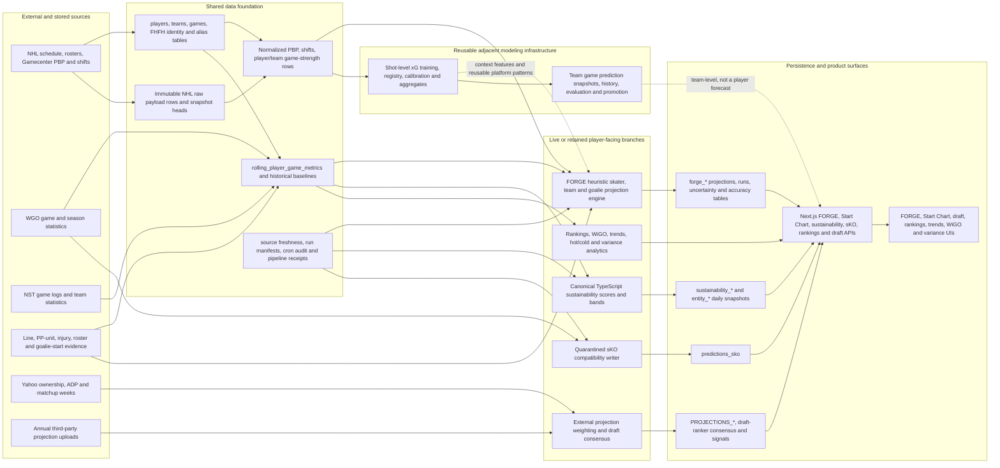
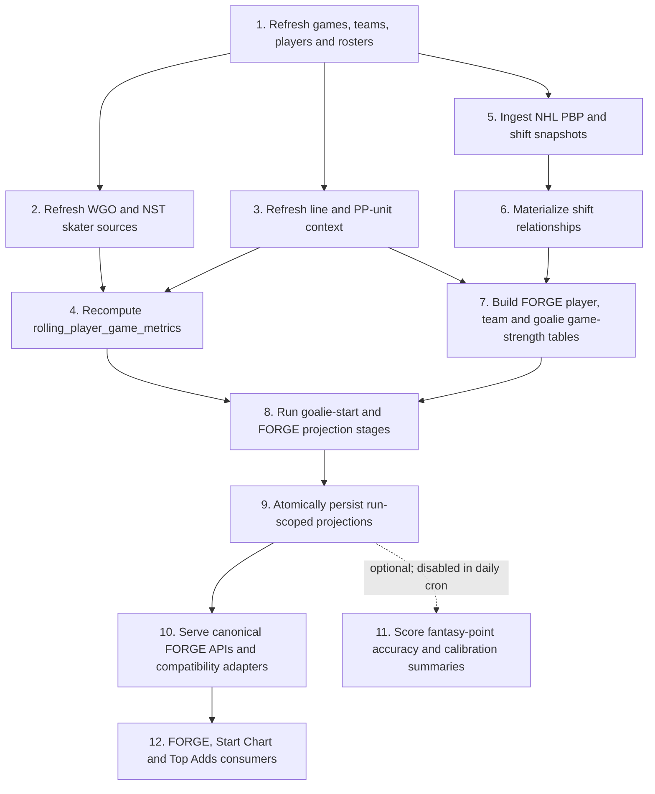
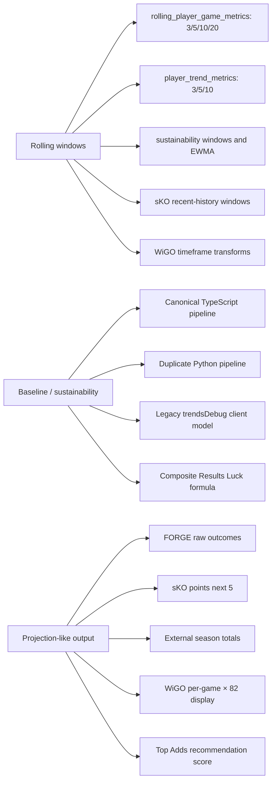

# Existing player-projection data flow

This map records the current repository, not the architecture to be selected by the final Deep Research Report. Solid paths are live or explicitly retained. Dashed paths are compatibility, adjacent, experimental, or incomplete paths.

## Authority and scheduler boundaries

- Active database authority is `supabase/migrations/`, beginning with `20260716112908_production_schema_baseline.sql`; `migrations/`, `web/supabase/migrations/`, `web/sql/`, and `supabase/migration-archive/` are historical, supplemental, or design evidence unless an active migration incorporates them.
- The canonical daily player-projection owner is the Vercel cron entry for `/api/v1/db/run-rolling-forge-pipeline` in `web/vercel.json`.
- `supabase/migrations/20260730091500_consolidate_scheduler_ownership.sql` disables duplicate pg_cron owners for the daily FORGE and TypeScript sustainability stages while retaining named jobs that have no Vercel owner, including weekly FORGE and sKO compatibility work.
- Repository evidence establishes configured ownership, not the current health or row counts of the deployed database. Those require a live, read-only production check.

## Shared dependency map

The common foundation is substantial, but no single branch supplies the required player system end to end. FORGE owns the current projection surface; sustainability owns a current-state score; sKO is explicitly quarantined; external projections are uploaded forecasts rather than an internally trained model; rankings, trends, WiGO, and variance are descriptive; and the xG/game-prediction branches provide reusable engineering patterns rather than a player-projection architecture.

## Canonical rolling-to-FORGE path

Repository contract: `web/lib/rollingForgePipeline.ts`. The raw Gamecenter portion has exact payload identities and versioned materialization receipts in `supabase/migrations/20260720105524_add_projection_materialization_transactions.sql`. WGO, NST, line, PP-unit, roster, and rolling inputs do not all have equivalent immutable forecast-time snapshots.

## System traces

| System | Source and ingestion | Identity and normalization | Feature or parameter fitting | Inference and persistence | Serving and consumers | Outcomes and refresh | Main reproducibility gap |
| --- | --- | --- | --- | --- | --- | --- | --- |
| FORGE skaters and teams | NHL PBP/shifts; WGO; NST; schedules; line and PP-unit context; `ingest-projection-inputs`, rolling recompute, relationship and derived builders | `players`, `teams`, `games`; normalized PBP/shifts; `forge_player_game_strength` and `forge_team_game_strength` | Hand-authored rolling blends, role scenarios, bounded context multipliers, reconciliation and uncertainty constants in `web/lib/projections/` | Request/batch execution in `run-forge-projections.ts`; `forge_runs`, `forge_player_projections`, `forge_team_projections`; atomic writers | `/api/v1/forge/players`, `/api/v1/projections/players`, `/api/v1/start-chart`; FORGE and Start Chart UIs | Optional `run-projection-accuracy`; daily rolling FORGE cron, weekly pg_cron retained | `as_of_date` is date-only; the run does not identify a complete immutable player feature snapshot or explicit feature/model version; several current-state sources can be reconstructed only approximately |
| FORGE goalies | NHL/WGO/NST goalie history; schedule/rest; line-source starter evidence; `update-goalie-projections-v2` | Shared player/team/game identity; `forge_goalie_game`; current candidate and team mapping | Heuristic starter logits, workload/save adjustments, scenario blending and Poisson-style uncertainty | `goalie_start_projections`, `forge_goalie_projections`; a separate unscheduled writer targets historical-migration-only mixture tables absent from the active chain | `/api/v1/forge/goalies`, compatibility goalie route, Start Chart, goalie-risk surfaces | FORGE accuracy tables and the daily pipeline | Confirmed/projected starter history and source timestamps are incomplete; conditional and unconditional semantics live partly in metadata and an orphan mixture experiment rather than a single versioned contract |
| TypeScript sustainability | Rolling metrics, historical baseline tables, player totals/stats and scheduled rebuild routes | Shared player identity plus position groups | Empirical-Bayes-style priors, z-scores, configured weighted scores, bands and backtest helpers | Batched rebuilds to `sustainability_*` and `entity_*` snapshots | Sustainability APIs, trends sandbox, FORGE dashboard sustainability/hot-cold cards | Vercel cron chain, recompute queue, health/coverage APIs | A score/classification is not an outcome forecast; historical source vintages and empirical support for weights/bands remain incomplete |
| Python sustainability | Same conceptual WGO/NST and baseline domain, implemented under `functions/lib/sustainability/` | Separate Python data and persistence helpers | Duplicate priors, windows, reliability, scoring and distribution logic | Offline/function pipeline; not the canonical web writer | No canonical product ownership; Python function infrastructure only | Pytest coverage; no active canonical schedule | Duplicate implementation can drift from the TypeScript owner; it must remain read-only unless given a distinct offline role |
| sKO compatibility writer | `player_stats_unified`/sKO tables populated from WGO-style history | Player IDs from unified views and sKO tables | Active writer uses a moving-average/stability formula; retained artifacts evidence a deleted offline next-five regression pipeline | `/api/v1/ml/update-predictions-sko` writes versioned `predictions_sko`; run manifest/lease protects writes | `/api/v1/ml/get-predictions-sko`, `skoCharts`, quarantined prediction components | Retained pg_cron job; route tests and run health | Active and offline model identities are not one governed model; leaked offline artifacts are not promotion evidence and historical feature snapshots are absent |
| External projection aggregation | Annual uploaded provider tables and optional custom projection sources | Player mappings plus draft-dashboard row reconciliation | User-controlled weighted averaging, season-total proration, fantasy scoring and rank transforms | Client/request-time aggregation; draft consensus/signal snapshots where used | Retained `/projections`, draft dashboard and draft-ranker discovery UI/APIs | Upload batches and UI analyses; no internal outcome-scoring owner | Provider methodology, license, observed-at timestamp, revision history and immutable vintages are not consistently persisted |
| Contextual rankings and composites | `rolling_player_game_metrics`, composite tables and metric registry | Player/team identity and peer groups | Percentile ranks and hard-coded composite weights/tier thresholds | Optional snapshot writers plus request-time fallbacks | Contextual-ranking APIs and `/rankings` | Tests and optional dry-run writers; composite writer is not scheduled | Descriptive rankings are not forecasts; selected-window leakage guard exists for Results Luck, but the weights and tiers are not statistically validated |
| Player trends, WiGO and variance | Unified/WGO game rows, rolling metrics, Yahoo weeks | Player/season identity, with legacy team-abbreviation fallbacks in places | Rolling means, sample variance, per-82 multiplication, baseline deltas and UI thresholds | Trend snapshot writer or client-side transformation | Trends, WiGO, variance and legacy goalie-value pages | Current-season refreshes and unit tests | Several pages silently turn historical pace or variation into projection-like labels; provider revisions and request-time reconstruction weaken historical fidelity |
| NHL xG | Immutable NHL PBP/shift inputs and versioned shot features | Game/event/player/team mappings with versioned feature contracts | Chronological train/validation/test tooling, calibrated shot-goal/rebound models and challengers | Model registry plus versioned shot predictions and aggregates | Underlying-stats/xG and operations surfaces; downstream feature consumers | Release validation, coverage audits, calibration and registry checks | It predicts shot outcomes, not player game/season outputs; reuse the platform and xG features only after forecast-time availability is demonstrated |
| Team game prediction | Schedule, team ratings, roster/goalie context, xG and market odds | Team/game identities and dated source contracts | Baseline team probability model plus backtests, ablations and promotion workflow | Immutable feature snapshots, append-only history, latest outputs and atomic promotion | Game-prediction APIs and `/nhl-predictions` | Automated scoring, accountability, calibration and cron forecasts | Team-game semantics do not answer player targets; only its registry/snapshot/evaluation patterns are directly reusable |

## Duplicated definitions and transformations

These branches share names but not targets, vintages, or validation. Migration work must preserve those distinctions and retire misleading labels only after each live consumer has moved.

## Consumer compatibility constraints

- Canonical FORGE readers: `/api/v1/forge/players` and `/api/v1/forge/goalies`.
- Deprecated-but-readable compatibility routes: `/api/v1/projections/players` and `/api/v1/projections/goalies`.
- Start Chart is a read-only adapter over canonical FORGE skater projections; its old materializer is retired. See `web/lib/projections/compatibilityInventory.ts`.
- The retained `/projections` page reads annual external source tables and explicitly points users toward FORGE; it is not a FORGE reader.
- Existing fantasy-point transforms must remain downstream of raw outcome forecasts. They appear in FORGE Start Chart helpers, draft-dashboard configuration, variance calculations, and external projection analysis.
- Current consumers are largely deterministic-table consumers. FORGE already carries quantiles in `uncertainty`, but stable top-level interval/distribution contracts are not universal.

## Evidence boundaries

- Current source code and active migrations were treated as implementation truth.
- Task artifacts were used only as dated evidence of prior live checks, not as proof of present production state.
- No live database, provider account, Vercel deployment, or production cron state was queried or changed during this audit.
