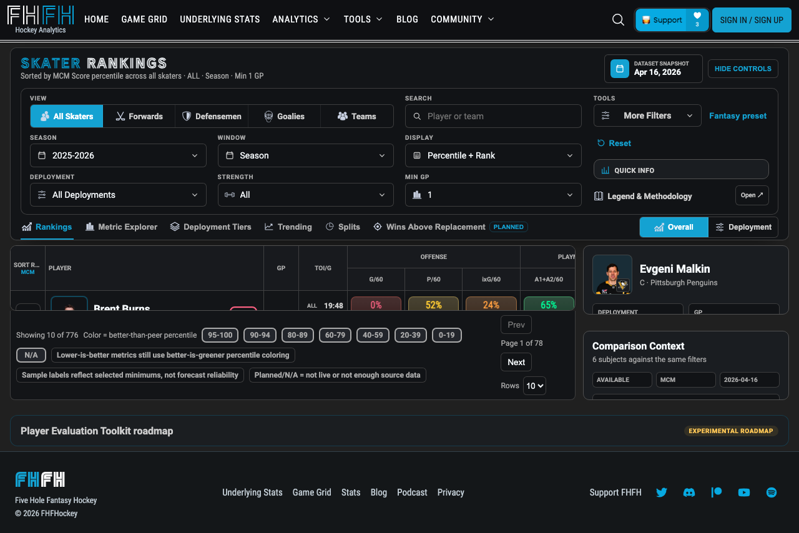

# Owner decisions and evidence

October 1, 2026. Owner decisions are explicit in the current chat. Database evidence was obtained through read-only Supabase SELECTs. No production records were changed. These are current mutable database snapshots, not immutable original ingestion receipts.

## Decisions that clear approval questions

- Starter Board: always serve today's slate or the upcoming slate. Implemented locally: past requests clamp to today; no-game dates select the earliest later scheduled slate independent of projection availability. Page controls reject past dates and correct historical URLs. Upcoming notices and links use the applied slate. API/page/freshness tests: 67 passed; final page/WiGO tests: 34 passed; TypeScript and targeted lint passed; Chromium preview/form/link scenario passed at six widths. Broader recovery/manual acceptance and historical producer lineage remain open.
- WiGO: zero/zero DIFF displays `-`. Implemented in `web/components/WiGO/tableUtils.ts`, its existing regression and comparison help. Focused tableUtils run: 5 tests passed. Genuine numeric zero remains available independently of undefined percentage change.
- Rankings: provide a fantasy preset. Implemented locally using existing MCM and fantasy category columns, season/all-strength comparison and the catalog's 1 GP/600-second eligibility rules. Selected season and expert controls are preserved; applied settings survive URL restoration. Filter/URL/page tests: 25 passed; TypeScript passed; targeted lint passed with an existing image warning; Chromium keyboard/reload/disclosure/no-overflow scenario passed at all five widths. The basis disclosure avoids predictive reliability claims. Metric stability/evaluation and source-component coverage remain evidence gates, not new approval questions.
- News: approved to proceed with the consumer-contract work. Separate classifier lineage, source-time identity and release gates remain evidence questions.

## Exact news examples located

See [database evidence](database-evidence.json).

- Kevin He injury headline: item `cac51da7-3f50-4109-b7b4-3ad80538f07f`, tweet `2104976276528542197`, review item `1e6b3258-e764-4b18-82b0-51295fbdb057`. Passage names Mathew Barzal; the linked subject is Kevin He (`8484864`). This directly establishes the current subject/passage mismatch. It does not establish the original writer version; current metadata/joins were updated October 1.
- Carson Soucy signing headline: item `4795b0c8-d119-4977-9b77-45e040224e25`, tweet `2104996083462271476`, review item `b5ecae82-3557-47ba-8c7f-bdd5c6491209`. Passage states the goal is to sign him and cap space must be determined. The signing headline therefore lacks completed-signing evidence. Metadata includes a signing phrase match, but `autoPublish=false` and `primaryRuleId=manual-review`; this snapshot alone cannot identify the publishing execution.

These exact IDs and passages can replace synthetic-only consumer regression inputs. Do not substitute the different Barzal post in the classification holdout for this record.

## WiGO and goalie source observations

- McDavid (`8478402`): NHL September 29 game `2026020004` has 1,371 total TOI seconds and 320 PP seconds; no matching September 29 NST row was returned. Four older selected dates have matching NST TOI. The current October 1 aggregate has nonzero L5/L10/L20 ATOI. This supports the source-gap failure class, but does not reproduce the historical displayed zero or certify which inputs produced that historical aggregate. No recompute was performed.
- Six current October 1 goalie rows have `start_probability=1` and `confirmed_status=false`; their game/team/player IDs and timestamps are captured. The table has no run/version column. These are current examples, not an authenticated match to the historical screenshot; historical producer attribution remains unresolved.

### WiGO source matching and database catalog follow-up

See [current source-catalog evidence](wigo-source-catalog-evidence.json). Read-only PostgreSQL catalog queries found no non-system SQL function definition containing `wigo_rates` and no non-internal trigger on that table. Nine matching cron entries were inspected through names, schedules, flags and command hashes only. Job 231 (`update-wigo-table-stats`) references `calculate-wigo-stats`; none of the matched commands mentions `wigo_rates`. This narrows the inspected paths but does not establish that no external/dynamic writer exists, identify deployed handler versions or prove a cron request completed its downstream work. Command bodies and credentials were not returned. The queried cron time-zone setting was unavailable; schedule strings are preserved without assigning a time zone.

The current NST scraper builds a single-date `gpfilt=gpdate` query and stores its URL date as `date_scraped`, alongside the supplied season. Its time parser converts MM:SS to seconds. These are inspected source contracts, not historical ingestion receipts. Live columns confirm NHL `game_id`/`season_id`/`date` and NST `season`/`date_scraped`; NST has no NHL game-ID column. Both NST all-strength tables enforce player/date uniqueness. For McDavid's current latest 20 NHL rows, one has no matching NST individual row, and the other matches have no unknown/mismatched seasons. This bounded current observation does not reproduce the original displayed-zero aggregate or certify population completeness.

The WiGO writer previously omitted season fields from the selected game logs and joined on date alone. It now selects existing season fields and joins the already player-scoped rows by season/date, rejecting missing/noninteger NST seasons. Missing or mismatched joins flow through the existing null/coverage safeguards. The latest-20 selection remains across seasons; it is not restricted to the current season, and no raw-unit conversion was changed.

The added wrong-season and missing-season cases failed before the join change. The complete existing writer file now passes 12 tests, including missing NHL season, wrong date and cross-season matches, plus prior complete/absent/partial/nonfinite/zero total TOI and separate PP coverage. Complete fixtures retain 5 goals/6,000 seconds→3 G/60, 5 games→20:00 ATOI and 2 PPP/600 PP seconds→12 PPP/60. TypeScript, targeted lint and scoped diff checks pass. Only mocked writes were exercised; no writer endpoint, recompute, database publish or deployment was triggered.

Tasks 4.1–4.3 remain open for overriding-producer lineage, actual aggregate window/coverage metadata, full metric-basis compatibility and historical/manual acceptance. Dot Scout was not listed among all pinned and the 50 returned recent chats in the renewed inspection; no chat was messaged.

### WiGO missing-count and rate-override follow-up

Recent NHL counters previously converted null to zero before aggregation. A missing numerator could therefore produce an apparently complete count or a rate based on a partial sum. The recent writer now preserves source nulls and requires every selected game to have finite inputs for each affected count, per-60 rate or ratio. Missing goals, points, shots, primary assists or PP points invalidate only their dependent metrics; missing PP percentage no longer becomes a partial-window average. Genuine zero remains zero, and separately covered PP seconds remain usable. Seasonal aggregation and raw units were not changed.

The reader also requires an available finite recent source rate before applying a legacy `wigo_rates` override, alongside the existing GP and denominator checks. Null/absent/nonfinite source rates remain unavailable across L5/L10/L20 even when an override supplies a number. This safeguard does not establish compatibility for a nonnull override from an unidentified producer.

Before the fix, five targeted negative cases failed: missing goals/PP points produced numeric rates, and null/absent/nonfinite recent rates were revived by an override. Existing writer and reader files now pass 20 tests each; the reader was checked again after strengthening its independently covered PP assertion. The existing percentile component file passes six tests. Targeted lint and scoped diff checks pass. TypeScript passes with `NODE_OPTIONS=--max-old-space-size=8192 npx tsc --noEmit`; the preceding default-heap run terminated with Node heap exhaustion.

The extended Chromium source-failure scenario passes at 1920×1080 and 390×844. Its fictional recent rows have missing points, zero goals, 20:00 ATOI and separately covered 11.25 PPP/60; a sentinel 999 rate override does not revive PTS/60. Desktop matrix and mobile comparison preserve the dash/zero distinction, and missing PTS/60 produces a dash DIFF. The browser caught a 20-pixel desktop overflow: the fixed last grid row was reduced from 396 to 376 pixels, and the empty percentile-cohort message now occupies the existing filter message area. All desktop coverage panels fit without overflowing elements, clipped table cells or text below 12 pixels in this scenario. These are consumer fixtures, not historical replay or live provider acceptance.

The separate existing “complete desktop matrix” scenario failed at its readiness assertion: the current 20262027 response reports “No rating data available for this player/season” instead of the expected “Offense” rating. It did not reach its complete populated-state layout checks or evidence-file writes; those checks are not claimed as passed. No retry or production data alteration was used to satisfy that assertion.

Only mocked writer mutations and read-only browser requests were exercised. No production writer endpoint, recompute, publish or deployment was triggered. Tasks 4.1–4.3 retain their source-lineage, aggregate-window, complete compatibility and historical/manual gates.

### WiGO populated-cohort and chart browser follow-up

The existing complete-desktop scenario previously stopped before its layout checks because the live 20262027 rating inputs were unavailable. It now intercepts NST percentile cohorts, selected-stat/NHL game logs and Game Score responses with explicitly fictional inputs, alongside its existing radar fixture. Player identity, aggregate/reference values, team drivers and schedule remain read-only live inputs. This separation exercises populated rating/chart controls without certifying that the production season is complete or that live aggregate and fictional game-log samples agree.

The unchanged acceptance assertions pass in Chromium: 37 headers (period plus all 36 metrics), eight rows (seven timeframes plus DIFF), 288 value cells, fixed selected-log geometry while changing metrics, all seven reference toggles, same-period comparison, TOI/PP controls, drag zoom/Shift-pan/reset on all three trend charts, all four percentile strengths, minimum-GP control, tooltips, cleared-player focus and keyboard-selected player replacement. All C01–C19 panels fit at 1920×1080, with no overflowing elements, clipped table cells, sub-12px rendered text/canvas labels, page errors or hydration/list warnings. This is one passing existing Playwright scenario, not a live-populated-data acceptance run.

The [current screenshot](wigo-populated-cohort-charts-fixture-1920x1080.png) was inspected and retained here. The test writes its screenshot into its own result directory and attaches its geometry measurements instead of overwriting older shared screenshots/measurement files. TypeScript passes with `NODE_OPTIONS=--max-old-space-size=8192 npx tsc --noEmit`; targeted ESLint and scoped diff checks pass. Historical inputs, live source completeness, native accessibility and the remaining 7.2 gates are unchanged.

## Rankings evidence

See [sample evidence](rankings-sample-evidence.json). Latest returned prior-season points snapshot is April 16, 2026: 776 skaters, season median 66 GP, minimum 1 GP, maximum 81 GP. All returned points rows are marked qualified, including one-game samples. No requested current-season/PP/MCM rows were returned at the latest selected snapshots. Do not describe this as complete season coverage or use existing qualification flags as stability validation.

`web/lib/rankings/metricDefinitions.ts` already defines `mcm_score` as a fantasy composite with component availability requirements and 1 GP/600-second minimums. Reuse that definition where supported; these minimums are existing eligibility rules, not demonstrated forecast reliability. A fantasy preset must disclose historical basis and unavailable components.

### Rankings secondary sample labels and native zoom

Native Chrome at 200% exposed remaining medium/high-confidence labels for one-/two-game skater samples in the comparison panel, plus unqualified sample tiers in the player snapshot. The existing sample formatter now explains the actual skater metric contract: medium meets selected minimums, high is at least twice both minimums, and low is below minimums or unavailable. Snapshot facts and comparison sample rows use the qualification flag rather than predicting reliability; null/nonfinite GP or TOI produces “Sample unavailable.” The same snapshot metric bullets and comparison source notes describe each metric's own tier. Goalie-specific sample/role wording and numerical calculation/filter behavior are unchanged.

Twelve new/strengthened targeted cases failed before the fix. The existing formatter, player-snapshot and page checks now pass 9/8/6 tests (23 total), covering one-game qualification, below-minimum inputs, missing/nonfinite counts, metric tier wording and the rendered comparison. TypeScript passes with the 8 GB heap setting; targeted ESLint passes with two existing image warnings; scoped diff checks pass.

See the [native zoom receipt](rankings-native-zoom-evidence.json), [preset-basis screenshot](rankings-native-zoom-200.png) and [one-game snapshot screenshot](rankings-native-zoom-sample-200.png). Chrome's native control explicitly reported 200%, with device pixel ratio changing from 2 to 4 and CSS viewport from 2056×1049 to 1028×524. Document width was 1020; no filter controls exceeded the viewport width. Enter activated the fantasy preset and its basis disclosure; the focused summary showed a rendered browser outline. After hot reload, Enter on the dedicated player-selection button displayed Evgeni Malkin's 1 GP, 18:22 TOI/G and “Meets selected minimums,” including the metric bullets. No broad low/medium/high-confidence GP claims or framework error overlay remained in the observed skater view. Rankings loaded real read-only data; the selected historical season and URL minimums were preserved. These observations do not validate dataset completeness or forecast reliability.

The local dev-server log also records fresh `/api/v1/contextual-rankings/snapshot` and `/comparison` requests returning HTTP 500 in the MCM/All context. No response error body was captured, so their cause is not established. Existing loaded matrix/fallback data and previous comparison data made the rendering checks possible; they are not evidence that every fresh request completed successfully. Live snapshot/comparison recovery remains unresolved.

Chrome zoom was restored to 100% (device pixel ratio 2), the task-created tab was closed and the task-created port-3100 dev server was stopped. This verifies one native Rankings rendering/control workflow; other surfaces' native zoom, screen readers, measured contrast, human first-time-user timing and real-account switching remain open. No production writes or deployment occurred.

The shared classification owner's latest [completion matrix](../../../lines-gdl-ingestion/audit/2026-10-01-classification-implementation.md) was inspected read-only. It records recovered original-author timestamps for its 11 seeds, recent zero-row caller receipts and bounded roster observations. Those are not immutable execution/source-time identity proof for the exact Kevin He/Soucy examples here. Its independent labels, temporal identity and deployed configuration gates remain open; no message was sent to that chat and no upstream acceptance was inferred.

## Coordination and remaining evidence

### Recovery and connected-candidate browser acceptance

Starter Board: loading, failed retrieval, retry, partial upcoming coverage and no-game state pass at 1180px/390px; the existing 1024px workflow now uses upcoming-date context and passes without captured page errors. The date-input minimum waits for client date initialization, preventing the demonstrated server/client clock hydration mismatch. Page tests (29), TypeScript and targeted lint passed. Older fixture observations are labeled stale; no historical producer certification follows from these fixtures.

Candidate pool: fictional authenticated Yahoo sessions and intercepted provider responses pass roster exclusion, non-rostered high-ownership inclusion, visible injury indicators, unknown waiver/addability, roster view, failed-sync general-pool fallback and successful refresh at 1180px/390px. Existing signed-out geometry/filter coverage remains separate. Pickup/provider tests (25) and TypeScript passed. Task 6.2 is locally accepted; real-account parity, native accessibility and broader 7.2 manual acceptance are not certified. No fixture credential is a real account credential and no provider write was performed.

### RSO readiness and Rankings sample acceptance

RSO readiness keyboard disclosure/action checks pass at 1180×757, 1024×768, 768×1024, 390×844 and 320×844. Enter/Space activation reaches the roster search input, rule summary, coverage heading and plan heading. Empty roster/no-game inputs retain unavailable coverage and unresolved acquisition legality; a no-op planner result no longer implies verified material rules. The focused empty-workspace component test passes (1 passed, 13 skipped); targeted lint completes with existing hook-dependency warnings. This accepts local task 3.1, not human first-time-user timing or the separate rules/continuity gates.

Rankings composite cells previously hardcoded high sample confidence, and composite sorting inherited Points/60's default 300-second minimum instead of MCM's 600 seconds. Composite qualification now uses each metric's existing catalog minimum or explicit request overrides and the existing minimum-relative confidence calculation. Missing/insufficient samples retain published values but have null rank/percentile, remain outside qualified sort ranks, and are excluded by the “Meets minimums” filter. Metric-specific cell qualification also applies when sorting by a non-composite metric.

Verification: matrix tests 15 passed, including seven unknown/threshold/override cases and independent cell/filter assertions; query tests 15 passed, including four MCM cases through the real matrix handler and snapshot reader. TypeScript and targeted lint passed. Local task 5.2 is accepted. No arbitrary new threshold, new composite model, data repair, forecast-reliability certification or deployment follows from this change; 5.1/5.3 evaluation and dataset gates remain open.

### RSO planning input review

The existing rules disclosure now asks the manager to review league rules, scoring, locks and player availability explicitly. Review is bound to the current account, provider/league/team, season/date range/time zone, effective rules, roster, locked assignments and player identity/eligibility/availability inputs. It is session state in the existing component, not a new settings store or a persisted verification flag. Changing those values or reloading requires review. Data-check timestamps alone do not change the reviewed values.

Acquisition alternatives remain “Needs review” and cannot be selected until the current inputs are reviewed, scoring is entered and the engine's legality/budget checks pass. The previous “Legal” wording becomes “Rule checks passed.” Readiness uses the same review boundary. Confirmation does not fill unknown scoring, acquisition cost or availability, override engine legality, grant access or execute a roster change. Schedule analysis, selected manual intent and advanced controls remain available. AGP labels use “active games”; bench games describe absent active assignments; projected outcome names league scoring as its basis. Existing DUST/utilization and bench-reason explanations remain available.

The new component regression initially failed because no confirmation control existed. Its planning-hook fixture uses the real engine's evaluated selected plan as a proposal to test presentation independently of candidate search. It verifies selection/wording before and after review, renewed review after scoring and roster edits, and continued blocking with empty scoring or acquisition cost. Its action timestamp is relative to the test clock so refreshed `asOf` does not make a fixture action historical. The complete component file passes 18 tests.

Two Chromium scenarios pass. The manual continuity case verifies keyboard review, rule edit invalidation and renewed review after reload at 1440×900/1920×1080. The readiness case preserves empty-workspace checks, then adds the fixture player and verifies Space activation of review, continued unresolved acquisition/scoring status and no horizontal overflow at 1180×757, 1024×768, 768×1024, 390×844 and 320×844. TypeScript and scoped diff checks pass; targeted lint completes with the four existing hook-dependency warnings.

Follow-up lineup acceptance keeps the control named “Lineup analysis” when assignment evidence is available. Before review, a status identifies proposed/saved inputs and directs the manager to review rules, locks and availability. A suggested assignment is qualified only after review, entered scoring, engine legality and assignment eligibility; selected acquisitions also require the existing budget check. Reviewed inputs with unresolved rules remain analysis. Capacity-only handling and forecast permissions are unchanged. The real mixed-coverage fixture verifies partial coverage, neutral analysis before review, keyboard confirmation, the qualified suggestion and the exact Knies/Kaprizov/Batherson bench explanation at all five required widths, with no horizontal overflow.

The connected fixture now has a current roster during both provider reads. Initial review is invalidated by refreshed roster/availability, while selected intent and locked-only identity remain intact. Alpha moving onto the actual roster produces the existing “review whether this selected add is complete” proposal; the first follow-up run incorrectly expected the older unavailable-player message and failed. Updating that assertion to the observed reconciliation branch makes the fixture pass. Account-save reopen disables confirmation and restores the unreviewed explanation; explicit manual continuation enables review and preserves selected intent and locks. The saved-manual component regression separately verifies disabled review in the read-only snapshot and enabled review after explicit fork. Authentication, provider responses and account writes are fictional/intercepted; no real account or provider write was made.

Follow-up verification: the component file passes all 18 tests. Eleven relevant Chromium scenarios pass across three bounded runs: five-width mixed coverage plus manual/connected retained blended inputs (3); corrected provider refresh/reopen/fork (1); weekly locks, manual eligibility, four forecast-permission modes and connected refresh/account-save evidence (7). The lineup-control selectors now describe analysis and retain their original assignment-eligibility assertions. TypeScript and scoped diff checks pass; targeted lint completes with four existing hook-dependency warnings.

Task 3.2 is locally accepted. Live accounts, native accessibility and human first-time-user measurement remain under 7.2. This consumer acceptance does not certify forecast accuracy, immutable historical lineage or FE producer/release gates.

### RSO lock identity and workspace continuity

Provider-input retention previously omitted players referenced only by saved lineup locks. The lock remained in the workspace, but its player identity disappeared from retained inputs. `retainProviderInputs` now includes saved lock references in its existing referenced-player set. Retained availability remains unknown; this does not restore verified provider availability or change acquisition rules.

The existing workspace regression failed before the fix and passes afterward with locked-only identity, unknown availability, nonempty protections and serialization assertions (5 tests passed). The existing saved-plan component regression now uses a selected conditional move, protected player and locked assignment; read-only reopen and explicit manual fork preserve them (1 passed, 13 skipped).

Two existing Chromium scenarios pass: manual daily→weekly rule recalculation and reload retain roster, selected intent, protections and locks at 1440×900/1920×1080; intercepted provider refresh retains locked-only identity and selected intent while displaying the changed-availability repair proposal. The connected scenario uses fictional authentication and intercepted provider/account responses, with no real provider or account write. Its first run triggered an unintended extra provider read from obsolete setup actions; removing those actions uses the seeded context. The manual scenario uses the combobox's accessible role because its implicit label includes option text.

Follow-up scoring acceptance extends the same manual browser scenario: changing GOALS weight to 2 and then 3 at the two desktop sizes preserves the roster, selected move, protection and lock, including after reload (1 Chromium scenario passed). The existing planning capacity/protection regression now also exercises scoring recalculation with a selected add/drop and a locked protected player. Doubling the points weight changes the projected total from 3 to 6, preserves the lock and selected steps, and leaves serialized intent/protections/locks unchanged (1 passed, 60 skipped). This separately proves engine recalculation and browser input persistence; it does not imply production forecast accuracy.

TypeScript passed before the follow-up test-only edits; targeted lint for both extended tests and scoped diff checks pass. These checks establish local consumer continuity, not live-account parity or the adopted FE producer/release gates. Task 3.3 remains open for its remaining acceptance scope.

### Local News consumer contract and verification

The application adapter consumes the existing `metadata.interpretation` / `TweetPlayerEvent` contract rather than rerunning a classifier. Versioned event arrays with no unresolved entries must contain supported event kinds/states, positive canonical IDs, explicit full names in matching source evidence, supported modality/availability, and no review conflict. Malformed or unsupported payloads use a neutral source report. This conservative full-name check can abstain on alias-only passages; it does not certify source-time canonical ID accuracy or producer lineage.

NewsCard and homepage injury rows present each supported event as a **report**, retain observation labels, and use its subject rather than the first news-player join. Event team/time/timeline fields remain in the typed claim payload; public source context, publication and receipt timestamps remain separately displayed. Missing/unresolved claims have no subject profile link or inferred injury status. NewsCard displays the original blurb instead of an automated summary. The existing upstream event schema does not define transaction completion, so homepage transactions use neutral source reports and preserve the passage instead of inventing signing/trade certainty. Unsupported transaction binding remains unavailable.

Player news flags require a matching bound event ID; an unrelated join cannot generate a flag. Flags describe the event as a report, use sanitized source attribution, and never replace absent publication time with creation time. Existing lineup-grid handling and separately sourced roster injury records are retained.

Verification: helper/card tests 34 passed; homepage tests 14 passed, including the two captured current records. The prior combined run passed 47 tests before the final Soucy homepage regression was added. TypeScript and targeted lint passed. Chromium homepage provenance/keyboard expansion/no-overflow scenario passed at the five required widths. The browser scenario verifies access and geometry, not deployed writer parity or immutable historical replay. No producer changes, production repairs or releases were performed. News task parents remain open for the original immutable lineage, source-time identity and broader semantic/manual gates.

### Integrated fixture flow and empty-standings recovery

The existing Starter Board browser spec now exercises homepage bound report → exact fixture player research → Starter Board → applied upcoming Game Grid range → RSO using rendered links and the existing desktop/mobile menus. Fictional versioned News metadata and intercepted page/API responses are identified in the spec; these are consumer acceptance fixtures, not historical identity or source-time certification. Browser REST writes are aborted. The season fixture includes the API's required date fields, avoiding an invalid-time error from an incomplete fixture contract.

The first corrected desktop run exposed a real empty-standings defect: Updates inherited the short empty standings panel height, leaving its row beneath the sticky header and blocking pointer access to the research link. The existing measurement now reserves the measured panel controls, table header and at least one 48px row before fitting pagination. Full-height standings keep their existing pagination behavior; stacked panels retain automatic height. The existing height/pagination unit regression passes (1 passed, 13 skipped). Targeted lint passes with the existing image-mock warning.

Chromium integrated scenarios pass at 1180×844 and 390×844. They verify report-qualified News wording, exact fixture research ID, applied February 9–15 schedule from the February 8 requested slate, board/schedule back-forward restoration, and RSO preservation of saved roster/rules, selected conditional move, protected player and its own February 9–11 planning range. Waiting for the restored grid to render before the next menu selection resolves the demonstrated mobile test navigation race; no navigation implementation was changed for it. These scenarios do not certify a live provider account, all five required geometry sizes, native zoom, screen readers, first-time-user timing or immutable historical replay. Task 7.2 remains open for those specific gates.

### Supported navigation context map

The current implementation was inspected for task 7.1. This map describes existing support, not a new cross-page context store. Route verification is distinct from the complete browser flow and account-switch acceptance under 7.2.

| Source → destination | Supported context and reset behavior | Authoritative implementation |
| --- | --- | --- |
| Homepage bound injury report → player research | A single bound claim supplies `/stats/player/{canonicalId}`. Unbound or multiple-subject summaries have no inferred player link. Source publication/slate/league context is not transferred. | `web/components/HomePage/HomepageStandingsInjuriesSection.tsx`; player route validates a positive safe integer and reads that exact ID from `players`, returning not-found when absent. |
| Direct WiGO research URL | `playerId` selects the canonical player and `tab` selects a supported workspace. Season comes from the existing current-season hook; comparison windows/minimum GP remain local UI state. A season or window query parameter must not be represented as applied. | `web/hooks/useWigoPlayerDashboard.ts`; `web/pages/wigoCharts.tsx`. |
| Starter Board → FORGE command center | Date, applied `resolvedDate`, position, team and mode parameters use the destination's existing parsers. Missing model/run metadata is not manufactured. | `buildContextHref` in `web/pages/start-chart.tsx`; command center's existing query parsers. |
| Starter Board → FORGE player / team research | Player research receives its canonical ID path, date, applied `resolvedDate` and mode. Team research receives its team path, date and applied `resolvedDate`. Ignored position/team filters and team-page mode are no longer appended. Player/team link titles and the visible workflow description disclose resets. | Starter Board helper; `web/pages/forge/player/[playerId].tsx` accepts date/resolvedDate/mode; `web/pages/forge/team/[teamId].tsx` accepts date/resolvedDate. |
| Starter Board → Game Grid | Seven days beginning on the applied slate are supplied as `startDate`/`endDate`. Team/position filters reset, as the link description states. | Starter Board helper and schedule link; URL-to-date parsing in `web/components/GameGrid/GameGrid.tsx`. Existing Starter Board page/E2E fixtures assert the upcoming applied date. |
| Starter Board → Trends | The applied slate supplies `date`; other filters reset, as disclosed. | Starter Board helper; `normalizeDashboardDate(router.query.date)` in `web/pages/trends/index.tsx`. |
| Starter Board → Splits / Lines / Goalie View | Splits receives selected `team`; Lines uses the selected team path. Date/position/mode reset. Goalie View opens its default view. | Starter Board helper and visible per-destination descriptions. |
| Trends → Underlying Stats / Splits / Starter Board / Game Grid | Existing static links do not transfer trend date/player filters. Descriptions now disclose default views/reset; Starter Board explicitly opens today's or the next scheduled slate. | `TRENDS_SURFACE_LINKS` in `web/lib/navigation/siteSurfaceLinks.ts`, consumed by the primary Trends page. |
| Rankings URL / fantasy preset → same Rankings surface | Selected season/window/strength, filters, matrix columns, sort and preset parameters use the existing normalized URL state. Browser reload preserves the preset. | `web/lib/rankings/rankingUrlState.ts`; existing filter/URL/page tests and preset browser receipt. |
| Existing navigation → RSO | RSO initializes/restores its own existing workspace/provider context. It does not consume source `startDate`, `endDate`, season or league query parameters. No link work overwrites saved rules, protected players or selected intent; a schedule selection must be reviewed in RSO's existing controls. | `web/pages/roster-schedule-optimizer.tsx`; initialization and hydration in `web/components/RosterScheduleOptimizer/RosterScheduleOptimizer.tsx`. This is a code boundary, not proof of live-account switching. |

No new parameters, persistence schema, league settings source or destination behavior were added in this navigation follow-up. Two focused existing Starter Board page tests pass for exact fixture IDs, same-day/upcoming requested/applied dates, player mode preservation, absence of ignored filters, and existing command-center/schedule context. The updated 1024×768 Chromium board workflow passes for rendered research URLs, visible reset disclosure, existing controls and no horizontal document overflow. Targeted lint and scoped diff checks pass. Other widths were not rerun for this copy/link follow-up. Local task 7.1 is accepted for the supported map and handoff parameters. The subsequent integrated fixture flow above accepts the complete navigation path and board/schedule history locally; live account switching and broader manual acceptance remain open under 7.2.

Dot Scout was not found in the available chat inventory; no message was sent to another chat. The requested evidence search was performed directly. Separate classification audit receipts were inspected without changing their implementation or claiming independent review.

Remaining evidence: immutable news writer execution/source-time identity receipts; exact historical goalie producer/version; original McDavid displayed-zero aggregate and its input receipt; rankings metric stability/evaluation and supported fantasy component coverage. Owner policy questions above are resolved and must not be requested again.

### Rankings request failure and filter-context isolation

Read-only local HTTP requests reproduced 500 responses from both `/api/v1/contextual-rankings/snapshot` and `/comparison` for skaters, season 20252026, season window, ALL strength, 1 GP / 600-second minimums, and descending MCM score. Snapshot selected player 8471215; comparison requested 8471215, 8470613, 8470621, 8471214, 8471675 and 8471685. Public responses contained the handlers' generic failure messages. Direct read-only execution of each builder/handler exposed PostgreSQL code `57014`, message `canceling statement due to statement timeout`. The cause is confirmed for these requests; the failing SQL operation and query-plan remedy are not yet established. No database setting, data, producer, deployment or production configuration was changed. Temporary diagnostics were removed from both API handlers.

The page's shared SWR configuration previously retained data from the old request key when filters changed. That let old matrix, snapshot and comparison results remain beneath new controls while requests loaded or failed. `keepPreviousData` is now false for Rankings queries. URL filters and normal same-key caching remain intact; loading/error states replace results from a different context.

The existing Rankings page test file now includes a real SWR hook/cache regression with deferred fetch responses. It first reproduced the prior-window rows after changing the window, then passed after the configuration change. It verifies the old matrix/snapshot/comparison content disappears during loading and after HTTP failure while the selected last-five window remains applied. All 7 page checks pass. Targeted ESLint passes with 3 existing image warnings; scoped diff validation passes. TypeScript fails in other working-tree files: `web/scripts/run-forge-local.test.ts:90` (Buffer/ArrayBufferView incompatibility) and `web/scripts/run-forge-local.ts:185` (incompatible literal comparison); no Rankings errors were reported. Those unrelated files were not changed here.

The local dev page initially rendered its Rankings controls without a framework error overlay, then the in-app browser entered a repeated full-refresh loop and crashed; this is not browser acceptance of the changed failure behavior. Its tab cleanup was blocked on the browser-generated crash page. The owned port-3100 dev server was stopped and its process exited successfully. The database timeout, browser recovery, and other live/manual/historical gates remain open under 7.2.

### Rankings timeout lookup and concurrent-read recovery

Further read-only tracing identified the failed operation in `fetchAllStrengthsToiByPlayerId`: the ALL-strength TOI lookup fetched every historical row for the page's player IDs, ordered by game date. Its first page returned 1,000 rows in 7.6 seconds; offset 1,000–1,999 failed after 8.1 seconds with PostgreSQL `57014`. The other traced source/metadata reads succeeded. A single-player lookup, using the same season/strength/date cutoff and selecting its newest game-date/latest-update row with `limit(1)`, succeeded in 317 ms.

`web/lib/rankings/playerMatrix.ts` now performs those bounded single-player reads with concurrency capped at six. It retains the prior game-date cutoff, same-day update selection, window denominator and missing-value behavior. The existing matrix pagination test now covers a newer same-day update, an older game with a later update timestamp, exclusion of a future game, a two-game five-window denominator, and missing/latest-null samples; its old historical scan first failed with the simulated timeout before the change. No database index, timeout setting or data was changed.

Direct live execution then returned the original six-subject comparison as available in 11,370 ms, followed by the selected-player snapshot as available in 1,627 ms within the same process. The latter used shared caches; these timings are not both cold-start measurements. Snapshot player 8471215 had ALL-strength TOI/G 1,102 seconds; both surfaces reported the April 16, 2026 dataset snapshot. Development and direct-run database URL/server-key equality were checked as booleans without printing either value.

The first browser attempts still failed under concurrent page traffic. The existing rolling snapshot cache did not share pending reads, so simultaneous callers repeated the same source fetch before its cache entry existed. `web/lib/rankings/rankingQueries.ts` now shares the pending read by its existing season/strength/snapshot/date-set cache key and applies each caller's team filter afterward. Settled promises are removed, including failures; successful cache lifetime starts when data arrives. The existing fallback test reproduced six source-date reads instead of three before the change, then verified three shared reads, separate team filtering, shared rejection and successful retry after a simulated timeout.

Verification: matrix/snapshot/comparison/source-query checks 35 passed; the subsequently extended failure/retry regression passes (1 passed, 14 skipped). TypeScript, targeted ESLint and scoped diff checks pass. The new case in the existing Rankings E2E file passes in Chromium (48.1 seconds) against the live read-only source: selected historical ALL/MCM controls render, snapshot and comparison HTTP responses are 200/available, Malkin's comparison context appears, loading completes, and no page error/framework overlay is observed. Server logs also confirm the final six-subject comparison returned 200. The first actual-context matrix/snapshot/comparison requests took approximately 43–44 seconds; the final six-subject comparison took 3.95 seconds. Unrequested default 5v5 requests still occurred before the URL context applied, including a failed default Trending request. This is functional recovery for the recorded requests, not acceptance of loading performance, all secondary routes or all current-season data.



The owned dev server was stopped and its process exited successfully. No deployment, production change, write, publish or recompute occurred. Task 7.2 remains open for initial/default-request behavior, loading performance and the other live/manual/historical gates. These changes do not prove ranking stability, fantasy component coverage or upstream source completeness.

### Rankings URL readiness and initial requests

`web/pages/rankings.tsx` now passes null keys for contextual queries until `router.isReady`; entity/tab requests, selected snapshots, comparison and opportunity context wait together. Context-independent metadata can load immediately. This follows the existing Next Pages Router readiness signal and SWR conditional-key behavior, without adding another URL-state store or changing selected filters. Relevant references: [Next router query/readiness](https://nextjs.org/docs/pages/api-reference/functions/use-router) and the locally read SWR skill's conditional fetching guidance.

The existing page test uses real SWR with an isolated cache. Before the change it reproduced default matrix, Trending and comparison requests while the router was unready. Afterward only metadata is fetched; supplying the ready URL starts matrix/snapshot/comparison requests with the selected season, ALL strength and 600-second minimum, and preserves the last-five window. All 8 page checks pass. TypeScript and targeted ESLint pass (3 existing image warnings); scoped diff checks pass.

The existing live Chromium scenario now captures every contextual request and rejects default/mismatched season, strength, GP or TOI settings. Its first run after this change passes in 19.9 seconds: actual-context matrix/snapshot/comparison API waits are approximately 15.5–16.5 seconds, followed by the six-subject comparison in 2.0 seconds. [First-load observation](rankings-url-ready-first-load.json) records 19,768 ms to completed rendered comparison; its response summary describes the initial one-subject comparison, while the captured request list and server log include the final six-subject request/200 response.

The response predicate was then strengthened to require the final six-subject comparison rather than the initial one-subject response. That revised test passes in 14.6 seconds on the same dev-server process. [Six-subject evidence](rankings-url-ready-evidence.json) records 14,441 ms from navigation to completed context, both HTTP statuses 200, all six subjects available and the exact five contextual request URLs. Every contextual request used the selected historical season/ALL/minimums, with no default 5v5 requests. The page had no framework overlay/page error, selected Malkin's context and completed its comparison loading state. [Rendered result](rankings-url-ready.png) retains the same controls and dataset-snapshot disclosure.

These are two local observations, not a controlled benchmark or production performance guarantee. The earlier roughly 43–44-second request observation remains part of the historical receipt above; initial unwanted requests are now locally resolved. Loading performance, other supported contexts, human timing, live-account and broader manual/historical gates remain open. The owned dev server was stopped with terminal exit 0; no production change or deployment was performed.

### Rankings actual composite coverage and unavailable sorting

[Read-only source evidence](rankings-composite-coverage-evidence.json) now queries `skater_composite_ratings`, the preset's actual MCM source. For season-window rows in the two requested seasons, the returned all-skaters cohort has 776 nonnull MCM rows at **20252026 / 5v5 / April 16**; deployment cohorts also return 5v5 rows. No ALL-strength rows or 20262027 rows were returned. The earlier generic `entity_metric_rankings` receipt cannot establish absence from this separate composite table. Nonnull values alone do not certify sample eligibility, scoring-component coverage or stability.

The stored regular-season schedule for 20252026 ends April 16 (1,312 scheduled games), matching the observed ranking cutoff; 105 stored playoff games follow that date. This establishes the relationship to the stored schedule, not completed-game ingestion or complete player denominators. The latest ALL rolling date contains 216 player rows for six games; that daily subset is not the full historical cohort, which the consumer reconstructs from earlier dates as well. Task 5.1's completeness/purpose gate remains open.

The page previously claimed “Sorted by MCM Score percentile” even when that selected context had no published scores. The matrix now returns the count of finite, minimum-qualified sort values across all filtered rows before pagination. The context summary explicitly says “No eligible values for MCM Score” when that count is zero. Partial coverage retains normal sorting; below-minimum and absent values remain unavailable. The fantasy preset retains ALL strength and its selected season/URL/sample controls.

Existing tests cover the full 250-row count rather than one visible page, composite eligibility thresholds, partial/missing composite coverage and both zero/nonzero page summaries. Matrix/page/URL tests **39 passed**; TypeScript and targeted ESLint pass (three existing image warnings), and scoped diff checks pass. The existing live Chromium scenario passes in 18.4 seconds, with matrix/snapshot/six-subject comparison HTTP 200, zero eligible MCM sort values, the explicit header warning, no default-context requests and no page error/framework overlay. [Browser response evidence](rankings-fantasy-availability-browser.json) records 18,161 ms to completed comparison; subject-level `available` means a subject was found and does **not** certify MCM availability. [Rendered page](rankings-fantasy-availability.png) shows the warning and April 16 dataset date.

The owned dev server was stopped with terminal exit 0. No publication, recompute, migration, production change or deployment occurred. Task 5.3 remains open for ALL-strength publisher/component coverage and metric-specific stability/evaluation evidence; the consumer warning cannot close those gates.

### Starter Board keyboard recovery and truthful live status

The better-accessibility skill was applied to task 7.2's recovery/control/status checks. Its screen-reader guidance distinguishes a stable polite status region from an urgent request alert. The header already retained its status node; it now has the accessible name “Starter Board status,” and its content describes the actual serving state. No new live region, focus movement or styling was introduced.

Status content findings:

| Severity | Location | Before | After | Why |
| --- | --- | --- | --- | --- |
| MEDIUM | `web/pages/start-chart.tsx:662,701,712,731` | A forward-selected slate said “Historical fallback”; no-games could say “Published slate”; two small labels said “Slate loading” after a failed retrieval. | “Upcoming slate” for a forward adjustment, “Adjusted slate” for other adjustments, “No scheduled games” for no-games, and unavailable labels after retrieval failure. | Visual and accessible status content must describe the recovery result rather than a contradictory source state. |

The existing loading/error and upcoming page fixtures failed before the named/status change, then passed. The extended assertions also cover the no-games status and removal of stale loading labels. All 29 existing page tests pass. TypeScript and targeted ESLint pass; scoped diff checks and both evidence JSON files validate.

The existing recovery Chromium scenarios now reach Retry through ordinary Tab navigation (23 presses at 1180px, 24 at 390px), verify its native focus indicator and activate it with Enter. They observe loading→unavailable→partial upcoming→no-games, retain the same header status node through retry, preserve requested/applied date disclosure and applied schedule links, and report no page error/framework overlay or horizontal overflow. Both scenarios pass after the final copy fix (2.8/1.1 seconds). The date-entry portion remains a fixture-driven control fill, not a claimed keyboard-only date-edit walkthrough.

Evidence: [1180px accessible states and focus properties](board-keyboard-status-1180.json), [390px accessible states and focus properties](board-keyboard-status-390.json), [desktop focused Retry](board-retry-keyboard-focus-1180.png), [mobile focused Retry](board-retry-keyboard-focus-390.png). Both screenshots were inspected after the final label changes. Computed focus is the browser's unmodified `auto` outline, 1px; rendered focus contrast was not measured. All API inputs are explicitly fictional; these checks do not certify live coverage or historical source lineage.

Approve for the inspected keyboard Retry path and browser accessibility-tree status semantics. Native screen-reader speech, native zoom on this surface, contrast and the remaining controls/surfaces are **not verified** by this receipt. The owned dev server was stopped with terminal exit 0; no production change or deployment occurred. Task 7.2 and the producer/historical gates remain open.

### Fantasy component builder and PP read-path evidence

The existing composite publisher (`web/pages/api/v1/db/update-skater-composite-ratings.ts`) accepts ALL strength, defaults to 5v5, and defaults to `dryRun=true`. `web/README.md` documents it as not yet scheduled in the current inventory; that statement does not rule out an external/dynamic invocation. The pure exported `buildSkaterCompositeRatingRows` function was invoked locally instead of the audited publisher endpoint, with season 20252026, cutoff April 16, season window, ALL strength, all skaters/deployments, 1 GP / 600-second minimums and limit 1,000. A network guard allowed only GET/HEAD; no non-read request was attempted and no upsert/publisher/cron endpoint was called.

[Before the read fix](rankings-fantasy-composite-builder.json), the builder produced 776 rows, 717 finite MCM scores and 59 null scores. Each of the six non-PP MCM components had 717 finite percentiles. PP points/60 was unavailable for the entire context, so none of the scores contained all seven components. These are unpersisted descriptive outputs, not published availability, reliability or predictive evaluation.

Read-only [PP input queries](rankings-pp-input-evidence.json) established two distinct causes. The latest April 16 daily subset has 216 rows at each returned strength and no PP average inputs. However, some older latest-per-player rows do contain those inputs. The source reader's explicit `ROLLING_RANKING_SELECT_FIELDS` omitted both PP averages and every supported recent PP total, preventing the existing extractor from seeing any of them. `web/lib/rankings/rollingRankingSelectFields.ts` now selects the eight existing numerator/denominator fields for season/L5/L10/L20. The owning rolling writer already defines `pp_points` and `pp_toi_seconds` from its existing NHL-backed helpers; neither that writer nor stored rows were changed.

The existing query mock now projects selected columns for its populated rolling fixture, matching the relevant database behavior. Four added window cases failed before the fix (15 existing cases passed), then pass with the field selection. Each verifies 2 PPP / 600 PP seconds → 12 PPP/60; genuine zero remains zero; null numerator, null denominator and zero denominator remain unavailable; 599 seconds retains its calculable value with no eligible percentile. Query/aggregation/composite-writer checks **38 passed**. TypeScript, targeted ESLint and scoped diff checks pass. No application build or browser run was needed for this read-only field-selection change.

[After the read fix](rankings-fantasy-composite-builder-after-pp-select.json), the pure builder's PP surface is calculable and no source metric is globally unavailable. All 776/717/59 counts and the descriptive MCM score distribution remain unchanged, and PP still has **zero eligible percentiles** under the selected minimums. The exact consumer date scope (latest 200 scheduled-game rows, deduplicated/capped at 30 dates) returns 25 dates beginning March 22, 776 latest player rows, GP min/median/max **1/2/3**, 262 one-game rows and 717 total-TOI-qualified rows. Only 108 rows have PP average inputs; 59 have positive PP time, ranging from **1–275 seconds** after season extraction. None meets 600 PP seconds. The initial broader 30-rolling-date probe returned 785 rows; it is retained and explicitly distinguished from the served cohort. These ALL rolling samples cannot be described using the earlier published 5v5 GP distribution or certified as a complete historical season.

The guarded audit [script](rankings-fantasy-composite-read-only.ts) is retained for reproduction. Run from `web/` with `NODE_PATH=./node_modules:. ./node_modules/.bin/ts-node --transpile-only --compiler-options '{"module":"commonjs","moduleResolution":"node","target":"ES2022"}' ../tasks/TASKS/in-season-trust-clarity-decision-workflow/evidence/2026-10-01/rankings-fantasy-composite-read-only.ts /tmp/rankings-composite-builder.json`. Receipts record actual Node v22.11.0, request, timestamps, read counts and hashes of repository source files present in the module cache. Those hashes were captured at receipt completion, not by an immutable loader; the before/after source hash comparison differs only for `rollingRankingSelectFields.ts`. Both runs completed successfully (58,559/8,175 ms); these are local observations, not a controlled performance benchmark.

Remaining 5.1/5.3 gates: validate the historical ALL participation/window/source inputs and PP coverage; obtain metric-specific stability/evaluation evidence and the intended landing-purpose sign-off; then prepare any necessary bounded repair/publication package under its explicit approval gate. No thresholds, formula, preset strength/season, database rows, schema, production settings or deployment were changed. Missing published ALL MCM scores remain unavailable in the consumer. The eight-field read omission is locally resolved; source completeness and release acceptance remain open.

### Stored rolling history and one-player read-only validation

[Stored/source comparisons](rankings-stored-history-evidence.json) show that the earlier ALL GP range of 1–3 is an inconsistent stored aggregate, not proof that those players actually had only one to three historical appearances. Malkin's March 5 row stores GP 45, then March 16 and later rows store GP 1. Current source counts through his latest April 12 row contain 56 distinct game IDs with positive TOI. Independently bounded latest-row comparisons also find Draisaitl stored GP 1 versus 65 source games through March 15, and McDavid stored GP 2 versus 82 source games through April 16. Their PP points/time are present in every returned underlying source row. These three cases do not certify the full population or authenticate the original WiGO displayed-zero aggregate.

The existing `fetchRollingPlayerAverages.ts` already separates complete prior-history reads from requested output bounds: `buildPlayerHistoryReadOptions` deletes the requested start date; `isWithinRequestedWriteWindow` controls emitted rows after the accumulators have consumed prior games. No duplicate writer fix was made. The existing public validation helper was invoked for **Malkin / 20252026 / ALL / April 12 only**, with a GET/HEAD-only network guard. It loads the full game ledger and prior player history, but only the one requested player/date/strength may be emitted; the guard and output checks are retained in the [reproduction script](rankings-rolling-history-read-only.ts).

[Validation output](rankings-rolling-history-validation.json) returns exactly one row, game `2025021276`, with GP **56**, season TOI average **1056.5 seconds**, season points average **1.089286**, PP points average **0.392857** and PP time average **181.910714 seconds**. This validates the current local complete-history path against the current sources, without changing the stored row (GP 1, TOI average 1102 seconds and null PP averages). It does not identify the historical producer invocation or prove the deployed writer uses this code. Actual runtime was Node v22.11.0; the read-only validation completed in 4,045 ms with no non-read request attempted.

The PP denominator was independently reconciled to the inspected existing source priority: 50 source games have a nonnull `powerPlayCombinations.PPTOI`, six fall back to WGO PP time, and their selected sum is **10,187 seconds**. The dry-run average times 56 reproduces this within rounding precision. The WGO-only sum is **10,606 seconds** and must not replace the selected denominator silently. Diagnostic missing PP-context rows (three) differ from missing PPTOI fields/fallbacks (six); the returned diagnostic coverage-warning count is one. No PP priority or raw unit was changed.

The dry-run team denominator is **88**. Read-only schedule counts reconcile it to seven stored type-1 and 81 type-2 Pittsburgh games through April 12; the inspected ledger includes game types without filtering. This is another scope question to resolve before certifying availability/denominator completeness. The preview is not a publication-ready repair package: before values are projections rather than a full rollback backup, immutable producer/version evidence is missing, and the retained coverage/schedule-scope questions remain open.

Both JSON receipts validate; assertions confirm one correctly bounded output, GP 56 matching the current source count, no non-read requests and selected PP denominator agreement. No application code changed, so no application suite/build was run solely for this evidence. Reproduce from `web/` with the same Node/ts-node options documented in the prior section, using `../tasks/TASKS/in-season-trust-clarity-decision-workflow/evidence/2026-10-01/rankings-rolling-history-read-only.ts /tmp/rankings-rolling-history-validation.json`. Source hashes record file bytes at receipt completion, not immutable loader pins.

Tasks 5.1/5.3 retain their source/evaluation gates. Any stored-row repair or subsequent ALL composite publication requires its separate bounded, backed-up approval package; this read-only validation is not authorization. No main writer, writer/publisher endpoint, upsert, production mutation, deployment or formula/threshold change occurred.

### Rankings visible context with collapsed controls

`rankingUrlState.ts` now describes the selected season as performance context and keeps both selected minimums explicit, including zero. Matrix summaries retain the eligible-sort-value warning and name active sample/source restrictions. Explorer uses its own metric. Deployment tiers ignore the preserved deployment selection that their request does not send; opportunity changes omit the unused selected window; splits identify their metric; planned WAR omits unused GP/TOI minimums. Non-skater secondary tabs disclose source-pending status. The historical defaults, sample thresholds, formulas and opt-in fantasy preset are unchanged.

The page uses the existing goalie/team summary helpers for those matrices. Their summaries now use the response's actual season and metric; goalie summaries use the actual window, role, minimum starts and minimum shots. Team summaries identify team style and ranked team count without borrowing skater strength/window/minimum claims. The dataset date continues to come from the active surface's source metadata, rather than request time.

The collapsed shell's CSS previously hid the header summary and dataset date. Both now remain visible when the filter controls are hidden. This was reproduced by the first Chromium run, which found the new summary text present but hidden after clicking Hide controls. Removing that scoped hide rule resolves the failure. The [desktop screenshot](rankings-visible-context-1180.png) and [390 px screenshot](rankings-visible-context-390.png) retain the selected season, ALL strength, season window, 1 GP / 600-second TOI minimums, zero-value warning and April 16 dataset snapshot above the results.

Verification: the two new helper tests failed before implementation; all **26** URL-summary/page tests pass afterward, including zero minimums, view-specific context, actual goalie/team units and preserved header content when controls collapse. Targeted ESLint passes with three existing page image warnings; the updated E2E file also passes its subsequent lint check. The first `npx tsc --noEmit` exhausted Node's default approximately 4 GB heap (exit 134); `NODE_OPTIONS=--max-old-space-size=8192 npx tsc --noEmit` passes after the browser server stopped. No dependency, compiler configuration or generated artifact was changed to obtain that result.

The corrected live Chromium scenario passes in **9.0 seconds** (15.3 seconds including server startup/teardown). It verifies visible collapsed context and date at desktop and 390 px, hidden controls, the Show controls action, no mobile horizontal page overflow, no page errors or framework overlay, actual-context API requests and successful matrix/snapshot/comparison responses. [Response receipt](rankings-visible-context-browser.json) records zero eligible MCM sort values, six available comparison subjects and 8,820 ms from navigation through final comparison checks; available subjects do not imply available composite scores. The Playwright-owned port-3100 server stopped; the subsequent listener check was empty.

This closes the local visible-context omission within 5.1. Full 5.1/5.3 acceptance still depends on the recorded historical source/producer/completeness questions and metric-specific stability/evaluation evidence. There was no database repair, composite publication, migration, remote build or deployment. Screen-reader speech, manual first-use measurements and other 7.2 acceptance surfaces were not certified by this check.

### Starter Board native zoom and scoring focus

Native Chrome loaded the current local Starter Board without intercepted API responses or a signed-in account. The October 1 slate shows eight games / 16 teams. The status says Review coverage; its disclosure identifies absent canonical skater rows and starting-goalie coverage for six of 16 teams, all six stale. The displayed 100% goalie weights remain projected; missing fantasy points/ranks remain unavailable. This is current live consumer evidence, not a reconstruction of the original historical 6/16 example or proof of producer completeness.

Chrome's native AX control reported **Zoom: 200%**. Device pixel ratio changed from 2 to 4; the CSS viewport became 1028×524 and document width was 1020. [Initial native screenshot](board-native-zoom-200.png) and [expanded-filter screenshot](board-native-zoom-filters-200.png) show the reflowed workspace. Enter on Next day selects October 2, where five games / ten teams and missing skater/goalie coverage are disclosed. Enter opens More Filters and the scoring disclosure. The expanded visible filter controls and all ten scoring fields stay inside the viewport; the More Filters summary has a rendered 2 px outline. Geometry measurements exclude descendants of closed details panels.

Native Tab from the scoring disclosure reaches the GOALS input. Before the repair, focused and unfocused inputs had the same 1 px border, no box shadow and outline style none: [before screenshot](board-native-zoom-scoring-before-200.png). `start-chart.module.scss` now supplies a scoped `input:focus-visible` outline using the existing primary color and 2 px offset. Native Chrome subsequently reports `rgb(20, 162, 210) solid 2px` on the focused GOALS field: [after screenshot](board-native-zoom-scoring-200.png). No scoring values were edited or submitted. This verifies the presence of the focus indicator; rendered contrast and screen-reader speech were not measured.

The existing five-row-preview/chart scenario now verifies Tab from the scoring summary to the GOALS field and a rendered focus outline at 768, 390 and 320 px. Its full existing checks pass across 1440×900, 1180×757, 1024×768, 768×1024, 390×844 and 320×844: **one Chromium scenario passed in 5.0 seconds** (5.5 seconds total). The first automated observation after editing returned outline style none; the native observation subsequently found the rule present. The check was changed to retrying computed-CSS assertions before the passing run. Targeted E2E lint and scoped diff checks pass. No application TypeScript changed; unit suites, TypeScript and production builds were not rerun for this focused SCSS change.

[Native geometry/focus receipt](board-native-zoom-evidence.json) retains the before/after input styles, selected date, source status, controls, page dimensions and empty captured console-error list. The live walkthrough restored October 1 via Enter on Previous day, then restored Chrome to 100% / DPR 2 and closed the task-created tab. The task-created port-3100 server was interrupted (exit 130); its subsequent listener check was empty. Native tab-level shortcuts initially left zoom unchanged; native app shortcuts on the selected task tab produced the verified 200% state.

Task 7.2 stays open for other native surfaces, actual screen-reader speech, measured contrast, human first-use measurements, live-account switching and historical/source acceptance. No database mutation, recompute, publication, migration, deployment, producer-rule change or scoring-model change occurred.

### Game Grid native zoom and candidate control clipping

Native Chrome loaded the live signed-out Game Grid for October 1–7 without intercepted API fixtures. The grid rendered 61 table rows with no framework overlay or captured console errors. The candidate drawer disclosed general candidates, global-ownership filtering, unknown league availability and unknown waiver status. Its initial live pool had 1,159 results. This verifies current consumer rendering; it does not authenticate a Yahoo league or certify stored metric completeness.

At **native 200%** (Chrome AX control; DPR 2→4; CSS viewport 1028×524), Enter opened the candidate drawer. The [before screenshot](grid-native-zoom-before-200.png) exposed clipping within its 247 px sidebar. Two 200 px minimum-width top-row controls required 412 px inside a 231 px section; unwrapped preset buttons and side-by-side metric groups also overflowed containers whose horizontal overflow was hidden. The added 1180 px regression independently failed because a control ended at x=354 while the sidebar ended at x=303.

The drawer-only rules in `PlayerPickupTable.module.scss` now wrap the title, top filter rows, preset buttons and metric groups within their available width. A second native inspection found the vertically flexible body also compressed the basic filter section to eight pixels while its content needed 187; the metric section had 50 pixels for 831 pixels of content. A second regression reproduced that clipping. Disabling shrink on the existing filter sections and reset control lets the sidebar's existing vertical scroller contain their natural heights. Afterward the basic section is 214/214 client/scroll pixels, the metric section 831/831, and the 141 px body scrolls through 1,143 px. No horizontally hidden overflowing filter container remains. Table and schedule scrolling are retained, with unchanged font sizes.

The [native control screenshot](grid-native-zoom-controls-200.png) and [geometry/focus receipt](grid-native-zoom-evidence.json) record the repaired state. Native Tab from the drawer handle reaches the ownership slider and then Team, with a rendered blue border and 2 px focus shadow. Keyboard `b` selects BOS (35 results); Enter on Goalies produces two results, with its visible 2 px focus shadow. Enter on Reset Filters restores ALL and 1,159 results. Enter closes the drawer and retains focus on its handle with a 2 px outline. The selected October 1–7 URL remains intact. The [closed overview](grid-native-zoom-200.png) has document width 1020 within the 1028 px viewport; the open drawer has width 1028, without page overflow.

Verification: both added clipping checks first failed. The existing candidate scenario then passes at **1180×757, 1024×768, 768×1024, 390×844 and 320×844**, retaining eligibility/filter/reset/availability assertions and adding control bounds plus non-clipped section heights. Final execution with a diagnostic trace passes in **9.0 seconds** (9.8 seconds total). One intervening run produced a blank 1180 px page before the candidate assertion; its cause was not established. The final run waits for the Game Grid heading before checking drawer visibility. Targeted E2E lint, scoped diff checks and receipt/screenshot validation pass. No application TypeScript changed, so TypeScript/unit suites and production builds were not rerun solely for the SCSS repair.

Chrome was restored to 100% / DPR 2, the task tab closed and the task-created port-3100 server interrupted (exit 130); its subsequent listener check was empty. This completes the inspected native zoom/control path within 6.3/7.2. Screen-reader speech, rendered contrast, other native surfaces, human first-use measurements, live-account switching and historical/source gates remain unverified. No database mutation, deployment, provider action, metric formula change or scoring-model change occurred.

### WiGO native zoom and named game-log controls

Native Chrome loaded the signed-out comparison URL with canonical player ID `8476453`; the search field and heading identify **Nikita Kucherov**. No intercepted fixtures were used for this walkthrough. The current-season summary shows no stats for 20262027, while the comparison retains legacy aggregate values with the explicit disclosure that aggregate dates and source coverage are unavailable. Rendering those values does not certify their provenance or completeness.

Native Chrome's AX zoom control confirms **200%** (DPR 2→4; CSS viewport 1028×524). The compact comparison has document width 1020 with no horizontal page overflow. Its [before screenshot](wigo-native-zoom-before-200.jpg) exposed game-log expansion buttons named only `+`. One attribute in `StatsTable.tsx` now gives each button a metric-specific accessible name, such as “Show Goals game log” or “Hide Goals game log”; existing `aria-expanded`, `aria-controls` and visible glyphs remain. Native Enter opens Goals with `aria-expanded=true` and a visible one-pixel browser outline. The completed [expanded control screenshot](wigo-native-zoom-controls-200.jpg) records the explicit “No game log data available for this season.” state. Enter collapses it and restores the Show name/false state. This is browser accessibility-tree and keyboard evidence, not a screen-reader speech test.

Keyboard `l` selects L5 on both comparison selectors. The [live zero-diff screenshot](wigo-native-zoom-zero-diff-200.jpg) and [DOM/focus/geometry receipt](wigo-native-zoom-evidence.json) record PPP and PPG values of zero with DIFF `-`; nonzero same-period comparisons show `0.0%`. The focused selector has its rendered blue border and two-pixel focus shadow. The retained canonical player/tab URL is unchanged. Actual window dates and source coverage remain unavailable; this observation verifies the requested zero/zero presentation only.

Verification: seven existing standard-table cases fail against the old unnamed buttons (the horizontal-matrix case passes). After the attribute change, **all eight table tests pass** in 436 ms. The existing Chromium scenario verifies named Goals controls, Enter expansion/collapse and the retained caption at **1180×757, 1024×768, 768×1024, 390×844 and 320×844**; it passes in 4.8 seconds (5.3 seconds total). Targeted ESLint for the component/test/E2E and scoped diff checks pass. TypeScript and full suites/builds were not rerun solely for this accessible-name attribute; numerical behavior and source reads were unchanged.

Captured console errors are empty and no framework overlay was observed. Chrome was restored to 100% / DPR 2; right comparison was restored to CA, while Home left the left comparison at L5. The task-created tab was then closed. The task-created port-3100 server was interrupted (exit 130) and its subsequent listener check was empty. Other native surfaces, actual screen-reader speech, measured contrast, human first-use timing, live-account switching, historical producer/version and source completeness/evaluation gates remain open under 7.2 and their owning tasks. No production write, publication, recompute, migration, deployment or producer-rule change occurred.

### Homepage News native zoom and disclosure keyboard evidence

The live signed-out homepage was served locally without intercepted fixtures. At native Chrome **200%** (AX zoom control, DPR 2→4), its CSS viewport is 1028×524 with document width 1020. All five visible News articles have equal client/scroll widths of 294 px. Tab from the FLA original-post link reaches the VAN original-post link with a visible solid 2 px focus outline. The [native source-focus screenshot](news-native-zoom-source-200.jpg) and [DOM/focus receipt](news-native-zoom-evidence.json) preserve that state. Enter selects the Injuries tab with selected-state semantics and a visible focus outline; the [injury-tab screenshot](news-native-zoom-injuries-200.jpg) records it.

The current FLA/VAN/TBL lineup cards and SEA/MIN source-report cards explicitly show Published and Observed times plus “Source unavailable.” SEA/MIN also disclose “Subject-to-claim evidence unavailable.” Injury rows retain “Claim unavailable” where binding evidence is absent. These are observations of serving text; they do not authenticate the source report, headline, lineup, classifier output or player-claim binding. The existing original-post links remain inspectable, but external posts were not opened or independently verified in this walkthrough.

At additional native **300%** (DPR 6; 685×349 CSS viewport; document width 680), the compact layout exposes its disclosures. Enter on FLA news changes its accessible name from Expand to Collapse and sets `aria-expanded=true` while retaining visible focus. Shift+Tab reaches that card's original-post link with its 2 px outline. Its expanded content retains the reported D-pair passage, Published/Observed times and unavailable attribution. Space collapses it and restores the Expand name. The [compact source screenshot](news-native-compact-source-300.jpg) records this supplementary zoom check; it is separate from the required 200% observation.

Enter on the first injury update opens its source passage and provenance: the report about Saros starting and Ufko playing with Josi, “Published Oct 1, 10:30 AM · Observed Oct 1, 10:17 AM · Source unavailable.” Its button exposes Collapse/expanded state and a visible 2 px outline; Space closes it. The [compact update screenshot](news-native-compact-update-300.jpg) captures the expanded state. The UI continues to label the claim unavailable rather than turning this passage into a verified player-specific claim.

The existing `navigation.spec.ts` homepage scenario previously checked update disclosure keyboard behavior but omitted News-card expansion. It now additionally checks named News expansion/collapse, timestamps, a visible HTTPS original-post link, link focus and its 2 px outline at 768/390/320 px. The complete existing scenario passes at **1180×757, 1024×768, 768×1024, 390×844 and 320×844**, retaining its update/provenance/no-horizontal-overflow checks: one test passed in 16.7 seconds (17.3 seconds total). Targeted E2E ESLint, scoped diff checks and JSON/screenshot validation pass. No application code changed; unit suites, TypeScript and builds were not rerun for this browser-coverage extension.

Chrome was restored to 100% / DPR 2, All updates was restored as the selected tab, and the task-created tab was closed. An initial native-app zoom action affected the previously selected user tab rather than the background QA tab; it was restored to 100% before selecting and verifying the QA tab. The task-created port-3100 server was interrupted (exit 130) and its subsequent listener check was empty. Captured QA-tab console errors are empty and no framework error dialog was observed. This accepts the inspected native News/update rendering and keyboard path; actual screen-reader speech, measured contrast, immutable source/classifier lineage, human first-use timing, live-account switching and remaining surface gates stay open. No source/database mutation, classifier rerun, deployment or external publication occurred.

### RSO native manual setup and empty-roster coverage prerequisite

Native Chrome loaded the live signed-out manual RSO workspace without intercepted fixtures. The existing workspace had zero roster players, no selected acquisition and dates October 1–14 in season 20262027. At **native 200%** (verified AX zoom control; DPR 2→4; CSS viewport 1028×524), document width is 1020. The responsive workspace deliberately scrolls vertically; its controls retain their existing sizes. No framework error dialog or captured QA-tab console errors was observed.

The [before screenshot](rso-native-zoom-readiness-before-200.jpg) and [DOM/focus receipt](rso-native-zoom-evidence.json) reproduce a readiness contradiction after live schedule loading: Roster needed and Plan awaiting inputs appeared alongside “Player-quality assignment evidence available.” The coverage message checked the selected evaluation's eligibility without first requiring roster players. `RosterScheduleOptimizer.tsx` now explicitly reports “Add roster players to assess player-quality coverage.” for an empty roster with a loaded nonempty schedule, before considering assignment eligibility. Existing loading, unavailable schedule and zero-game messages are retained; the planner and forecast permission rules were not changed. The [repaired readiness screenshot](rso-native-zoom-readiness-200.jpg) confirms the actual live result.

The existing empty-workspace component test now supplies a scheduled game and uses the real `planRoster` evaluator, reproducing the state that the previous empty-schedule/null-evaluator fixture omitted. It first fails against the old coverage message. After the guard, **all 19 existing component tests pass** in 1.27 seconds (2.21 seconds total). The existing five-width readiness scenario now supplies a scheduled game and asserts that empty roster coverage cannot claim player-quality evidence. It passes at **1180×757, 1024×768, 768×1024, 390×844 and 320×844**, retaining keyboard destinations and input-review assertions: 4.5 seconds (5.1 seconds total). Targeted component/test/E2E ESLint passes with four preexisting hook-dependency warnings; scoped diff and receipt validation pass. No full TypeScript check or build was rerun for the single existing-value guard; component execution and targeted lint cover the changed surface.

Native Tab from Planning readiness reaches Review roster; Enter focuses the Find a player input. Space on Review rules opens/focuses its existing summary and exposes proposed daily mode/slots plus the explicit input-review requirement. Enter on Review coverage reaches `rso-matchup-heading`; Space on View plan reaches `rso-itinerary-heading`. Each destination is within the 1028×524 viewport, with input/control focus showing the existing solid 2 px indicator. The [rules screenshot](rso-native-zoom-rules-200.jpg) records that existing disclosure. This verifies browser keyboard/focus semantics; it is not a screen-reader speech or contrast measurement.

The live manual setup then searches for **Nikita Kucherov · TBL · RW**. Tab reaches Add with visible focus and Enter adds the canonical player. The loaded result explicitly shows schedule-only capacity, unresolved player-quality decisions, unknown acquisition allowance, unavailable projected outcome and unknown goalie minimum. Space opens the existing schedule-capacity assignment. The actual October 1–14 shared schedule yields five future scheduled/active games, zero bench games and no selected acquisition, with the separate selected-date view showing zero planned starts on October 1. The [manual result screenshot](rso-native-zoom-manual-200.jpg) and receipt retain the values and limitations. This is a signed-out live consumer walkthrough, not a provider account, independently authenticated schedule, approved forecast or declared first-time human timing sample.

The existing Undo action restores the original zero-player workspace and no selected acquisition; roster/rules/dates were not replaced with a saved fixture. Chrome was restored to 100% / DPR 2 and the task-created tab closed. The task-created port-3100 server was interrupted (exit 130); its subsequent listener check was empty. Tasks 3.3/7.2 and the broader historical/producer/evaluation gates remain open for their uncaptured scope, including actual screen-reader speech, human measurements and live accounts. No remote workspace save, provider action, database mutation, publication, migration, recompute or deployment occurred.

### Exact News author originals and classification contract reconciliation

Read-only signed-in Chrome opened the **exact** two repost IDs from `database-evidence.json`. X redirects each to its author-original permalink while retaining the Game Day News repost label. The relevant article was identified by its observed original permalink, not by assuming the first conversation article or using a different classification holdout post. [Browser evidence](news-exact-original-browser-evidence.json) records the author, original/repost IDs, full visible source text, DOM `time[datetime]`, separate stored receipt/publication times and limitations. [Barzal screenshot](news-barzal-original-browser.jpg) and [Soucy screenshot](news-soucy-original-browser.jpg) preserve the observed pages.

| Stored item / exact repost | Author original | Author publication | What this proves |
| --- | --- | --- | --- |
| Kevin He headline `cac51da7-3f50-4109-b7b4-3ad80538f07f`; repost `2104976276528542197` | [Andrew Gross / `2104975130573070778`](https://x.com/AGrossNewsday/status/2104975130573070778) | September 29, 2026, 16:42:34 UTC / 12:42:34 Eastern | The original passage names Mathew Barzal and describes his absence from the next opener; it does not name Kevin He. |
| Soucy signing headline `4795b0c8-d119-4977-9b77-45e040224e25`; repost `2104996083462271476` | [Mark Scheig / `2104945363517837788`](https://x.com/mark_scheig/status/2104945363517837788) | September 29, 2026, 14:44:17 UTC / 10:44:17 Eastern | The original describes an intention to sign Carson Soucy while cap space still needs resolution; it does not establish a completed signing. |

Both normalized original passages match the corresponding stored blurb. Normalization removes only the leading `RT @handle:` prefix, decodes the provider's escaped apostrophe and collapses whitespace; raw browser text remains in the JSON. SHA-256 digests retain the comparison. The author-original DOM timestamps are independently converted to America/New_York with `zoneinfo`; they are not substituted for `observed_at`, public item `published_at` or event-occurrence time. No Last edited label was visible on either inspected article, but that is not an exhaustive edit/correction-history audit. The screenshots/DOM remain current observations rather than immutable original ingestion receipts.

The previously missing integration-document reference is now narrowed to the existing [classification hardening task plan](../../../lines-gdl-ingestion/tasks-prd-hockey-update-classification-hardening.md) and [implementation report](../../../lines-gdl-ingestion/audit/2026-10-01-classification-implementation.md). They reference the separately supplied identification/classification PRD and define the local `2026-10-01.1` interpretation/inference contract. This does not assert that the original user-supplied PRD text was recovered as a standalone file or that its open requirements are complete. Current `TweetPlayerEvent` fields reconcile to the public adapter as follows:

| Contract field | Current consumer mapping / limitation |
| --- | --- |
| `playerId`, `playerName`, optional `teamId` | Claim subject replaces unrelated news-player joins. A positive canonical ID and a full-name match in its source evidence are required; source-time identity correctness remains an upstream gate. |
| `evidence.text`, offsets, optional `offsetBasis` | Matching sanitized evidence text is required in the card's stored source passage. Raw-source offsets remain retained contract data, not offsets into public sanitized text. |
| `kind`, `state`, `modality`, `availability`, optional `observation` / `reviewReason` | Supported injury/goalie/participation reports retain state and practice/warmup/first-off observations. Conflicting, unresolved, malformed or unsupported payloads abstain. A report is not a verified game outcome. |
| `times`, `timeline`, `timelines` | Optional event time/timeline data remain in typed claims. Unresolved applicability is not silently converted to the source receipt, item publication or a confirmed return date. |
| Item `observed_at`, `published_at`, source attribution/URL | Receipt and publication labels remain separate; missing values stay unavailable. The newly observed author-original timestamp is evidence only, without mutating stored attribution/times. |
| Versioned `metadata.interpretation`, `events`, `unresolved` | Existing JSON schema is reused without a second classifier. Transaction completion has no supported event kind in this contract, so public transaction binding remains unavailable. |

The current classification plan/report explicitly retain independent annotation, source-time membership, broader mixed-time/correction authority and deployed flag/model/enrichment gates. Its paused chat was not resumed or messaged. A fresh chat inventory returned all eight pinned plus 50 recent chats; none had Scout in its title. No Dot Scout capability or matching chat was identified, and no message was sent. The separate chat “Audit FHFH forecasting gaps” is authoritatively active at revision 9; its latest turn is implementing a resumable calendar coordinator after verifying a local database fence. That progress is not producer/release acceptance for this initiative.

### Completion audit after local consumer QA

The previous goal turn made progress: a demonstrated RSO readiness defect was fixed and verified. The current turn adds exact author-original evidence and reconciles the classifier integration reference. The full objective remains **incomplete**. The task checkboxes below retain their original acceptance scope; current screenshots, mutable records or synthetic fixtures are not substituted for stronger gates.

| Task | Evidence and completion disposition |
| --- | --- |
| 1.1 | Existing typed contract and paused upstream plan are now linked/mapped above. Full upstream contract/source-time identity and release integration remain open. |
| 1.2 | Consumer safeguards, exact current database captures and both author originals are available. October 2 discovery identifies two stored publisher batches whose start timestamps exactly match the captured publication times; retained response literals include disabled inference and a prompt-version label. Explicit item-to-run binding, original deployed code/version and broader identity/semantic acceptance remain open. |
| 1.3 | Local sanitizer/attribution/timestamp tests and five-width/native keyboard receipts establish local acceptance. |
| 2.1 | Current API/source coverage and live slate receipts distinguish observed missing/stale/retrieval cases. October 2 read-only discovery adds four stored goalie-v2 POST audit receipts with reported updates 13/11/0/0 and a canonical-writer ownership declaration. Historical screenshot attribution, deployed version, immutable inputs and per-row run linkage remain open. |
| 2.2 | Today/upcoming policy, recovery fixtures and native live date/filter controls establish local acceptance. |
| 2.3 | Null rank, probability/confirmation/residual safeguards and their scoped checks establish local acceptance; historical producer proof stays with 2.1. |
| 3.1 | Loaded-schedule empty-roster prerequisite, readiness destinations, 19 component tests, five-width/browser and native manual setup establish local acceptance. Human first-use measurements remain under 7.2. |
| 3.2 | Input-review/wording regressions and native rules/schedule-only result establish local consumer acceptance. |
| 3.3 | Local retained intent/locks/protections and recalculation fixtures pass. Account switching cancels old provider requests, resets access and rejects stale provider/save results; mounted Chromium verifies these paths and clears the old save notice. October 2 retained-provider inputs now honor their read-only label until an explicit manual fork, preserving selected moves/protections/locks and restoring editing afterward. Adopted FE continuity/producer/release evidence and real-account parity remain open. |
| 4.1 | Current season/date source join, units and missing-input fixtures pass. Override producer and exact historical McDavid aggregate/input lineage remain open. |
| 4.2 | Missing numerator/denominator and legacy override safeguards plus zero/zero policy pass. Complete metric/window compatibility and authenticated source coverage remain open. |
| 4.3 | Actual GP, cross-season selection, units and unavailable date/coverage disclosure are visible. Stored aggregate window/cutoff/coverage metadata is still absent; current source reconstruction cannot prove original aggregate inputs. |
| 5.1 | Applied context/date/restrictions, read-only cutoff/composite reads and collapsed controls are verified. Dataset completeness and historical producer/version evidence remain open. |
| 5.2 | Metric-relative minimum explanations, unknown/tiny-sample regressions and native skater labels establish local acceptance. |
| 5.3 | Reproducible opt-in fantasy preset and component read-path fix are implemented/verified. Metric stability/evaluation and qualified component completeness remain open; no publication is authorized or implied. |
| 6.1 | Existing verified payload normalization tests and five-width rendering establish local acceptance; exact historical failing raw row remains unresolved. |
| 6.2 | Signed-out/live general-pool and fictional connected exclusion/availability/retry checks establish local consumer acceptance. Real Yahoo account parity remains under 7.2. |
| 6.3 | Strengthened clipping regressions, five-width controls and native 200% drawer/filter/reset checks establish local acceptance. |
| 7.1 | Supported route map and integrated fixture navigation/history verify local context transfer without replacing saved intent. |
| 7.2 | Per-surface geometry scenarios, integrated fixture flow at all five required viewport sizes and native zoom/control paths have recorded receipts. Starter Board's selected rendered status/recovery text pairs pass measured contrast on desktop/mobile; other surfaces and focus indicators have no contrast approval. Actual screen-reader speech, human first-use sample/timing, live-account switching and outstanding source/history/evaluation gates remain open. |

The remaining gates require particular evidence: immutable writer/source/run receipts for historical assertions; aggregate window/component and stability/evaluation contracts from their owning producers; authorized real-account access; and a declared human/screen-reader test. The known policy decisions are already resolved and need no repeated approval. Source verification here triggered no production write, classifier replay, deployment, external post or chat message. JSON parsing, exact passage comparison, timestamp conversion, screenshot signatures and scoped Markdown diff checks pass; application tests were not rerun solely for this evidence/documentation change.

### Integrated fixture workflow at all five required viewport sizes

The existing `web/e2e/start-chart.spec.ts` integrated scenario now runs at 1180×757, 1024×768, 768×1024, 390×844 and 320×844. It follows the rendered News player link, opens Starter Board through the actual desktop/mobile navigation, selects a requested date without games, follows the applied upcoming slate into Game Grid, verifies back/forward date restoration, then opens RSO and verifies saved roster, rules, intent, protected-player and workspace-date preservation. Page errors remain empty at every size.

The initial run passed four sizes; its first desktop navigation returned to `/404` before the News fixture appeared. The scenario now opens and closes the existing Player search dialog before leaving `/404`, establishing an interactive starting page. The first retry used the wrong dialog name and failed; the corrected final run passes all five scenarios in 16.8 seconds. This is fixture verification and does not establish a production navigation defect or certify real-account switching.

Targeted ESLint passes. The [structured receipt](integrated-five-width-evidence.json) and [final test output](integrated-five-width-final.log) retain exact sizes, command and scope; earlier failed-run logs are retained beside them. Application behavior was not modified. The owned port-3100 server was interrupted (exit 130), and its subsequent listener check was empty. Screen-reader speech, measured contrast, human first-use measurements, real-account switching and producer/history/evaluation gates remain open under 7.2 and their owning tasks.

### Starter Board rendered status and recovery text contrast

The better-colors skill was applied alongside the existing accessibility workflow. The existing recovery scenario now captures actual computed foreground, font size/weight and ancestor backgrounds for loading/unavailable/upcoming/empty header statuses, refresh text, request error and Retry text, missing-projection/no-game messages and the applied-date notice. Every requested capture must contain a rendered sample. Its existing keyboard recovery, retained status node, date recovery and page-error assertions still pass at 1180×844 and 390×844: **2 Chromium scenarios passed in 3.0 seconds**, and targeted ESLint passes. No product styling changed.

The [reproducible calculation](measure-board-status-contrast.py) consumes [desktop computed samples](board-status-contrast-1180.json) and [mobile computed samples](board-status-contrast-390.json), alpha-compositing their browser-resolved background layers to the first opaque surface. Captured samples have no background image, ancestor opacity change, filter, blend or generated pseudo-element content affecting this calculation. All 34 normal-text samples meet the unrounded **4.5:1** threshold from [WCAG 2.2 SC 1.4.3](https://www.w3.org/WAI/WCAG22/Understanding/contrast-minimum.html). [Measured results](board-status-contrast-measured.json) retain every exact ratio, foreground/background and threshold.

| Rendered pair (same colors at both measured sizes) | Ratio | Result |
| --- | --- | --- |
| Cyan loading/unavailable/no-scheduled-games status on header | 6.208714:1 | Pass |
| Secondary refresh text on header | 7.873182:1 | Pass |
| Amber upcoming-slate status on header | 12.138665:1 | Pass |
| Primary error/Retry/missing-projection/no-game text on error surface | 8.948371:1 | Pass |
| Secondary error/missing-projection/no-game text on error surface | 6.185830:1 | Pass |
| Primary applied-date text on notice surface | 7.999390:1 | Pass |
| Secondary upcoming-date explanation on notice surface | 5.529819:1 | Pass |

No actionable color findings in these inspected text pairs. **Approve only this captured text scope.** The rendered dark appearance is recorded in the [desktop partial-state screenshot](board-status-contrast-1180-board-partial-upcoming.png) and [mobile error/Retry screenshot](board-status-contrast-390-board-retry-keyboard-focus.png); empty-state and counterpart-size screenshots are also retained beside them. [Browser output](board-status-contrast-browser.log) records the focused command's result; [lint output](board-status-contrast-lint.log) is empty with exit 0. The task-created port-3100 server was interrupted (exit 130), and its subsequent listener check was empty.

Other surfaces, other appearance modes, focus indicators, icons/graphs, hover states, actual screen-reader speech, human measurements and real-account switching remain unverified by this receipt. No database write, production repair, publication, recompute, migration or deployment occurred. The user has been asked to identify the first-use participant and target screen reader so those human acceptance gates can be completed without simulated evidence.

### RSO account-switch request and save isolation

Current-state audit identified two local gaps beyond the previous fetch-token test. With user A's provider request pending and user B's access response deferred, the old request was not canceled and old access remained enabled. A save initiated by A could also finish after switching to B and display “Saved to account.” The two existing component tests were extended with deferred responses: each failure was reproduced before its corresponding runtime fix.

`RosterScheduleOptimizer.tsx` now resets access/error and owned-team state on user changes, aborts the old provider request, and includes authenticated identity in its request/result guards. Save callbacks check that identity before dispatch and before handling success/conflict/error results. The provider regression resolves a late old snapshot despite cancellation and verifies it cannot repopulate provider inputs; local selected intent, roster and manual players remain intact. This does not migrate or clear the manager's local workspace.

All **19 RSO component tests pass** (2.21 seconds total). Targeted ESLint passes with four existing hook dependency warnings, and the scoped runtime/test diff whitespace check passes. Whole-web TypeScript was run with the established 8 GB heap and **failed** at `scripts/run-forge-calendar-local.ts(264,35)`: TS2345, `Buffer` not assignable to `string | ArrayBufferView`. That calendar-runner file belongs to ongoing forecasting work and was not changed or retried here. No error was reported in the two touched RSO files; the whole-web check is still failed.

The [structured receipt](rso-account-switch-evidence.json), [provider failure](rso-account-switch-provider-red.log), [save failure](rso-account-switch-save-red.log), [passing tests](rso-account-switch-tests.log), [lint output](rso-account-switch-lint.log) and [TypeScript failure](rso-account-switch-types.log) retain the actual checks. These are mocked component/session/provider/save responses, not browser or real-account switching acceptance. Tasks 3.3/7.2 remain open for their shared FE/live/human gates. The latest bounded forecasting-chat snapshot reports an active in-progress turn, not a completed calendar scope/coordinator or release receipt; the paused classification chat was not resumed or messaged. No external save, provider operation, database write, migration, deployment, forecast generation or recompute occurred.

### RSO mounted browser session switch and stale save notice

The existing connected refresh/account-save Playwright scenario now retains its forecast-permission/exclusion assertions and then exercises a mounted account switch. Its fictional persisted session is changed through the installed Supabase client's actual `BroadcastChannel` subscription; React user state is not patched. Auth, provider, workspace, access and REST responses remain intercepted. New-account access is deliberately deferred while an old provider request and old save response are pending.

The first attempt incorrectly expected a disabled save button; the interface correctly hides that control while capabilities are unavailable. After correcting the assertion, Chromium reproduced an already-visible “Saved to account” notice surviving the user switch. The user-change effect now clears that exact success notice while preserving other local notices. The existing save component regression first creates a successful visible notice, starts another pending save, switches users and verifies the old success cannot remain or reappear.

Final results: **1 Chromium scenario passed in 3.2 seconds**, all **19 component tests passed in 2.10 seconds**, targeted ESLint passed with four existing hook dependency warnings, and scoped diff whitespace passed. The browser proves the old provider request ends with `ERR_ABORTED`, new-account workspace reads use the new fictional subject, provider refresh is disabled and save is hidden during unresolved access, completed late save responses do not display success, old provider names do not appear, and local roster/locks/selected intent remain intact. Captured page errors are empty.

The [browser receipt](rso-account-switch-browser-evidence.json), [passing browser output](rso-account-browser-final.log), [component output](rso-account-browser-unit.log), [lint output](rso-account-browser-lint.log), [reproduced stale-notice failure](rso-account-browser-stale-notice-red.log) and [initial selector failure](rso-account-browser-selector-failure.log) retain exact outcomes. Compare the [before screenshot](rso-account-browser-stale-notice-before.png) with the [after screenshot](rso-account-browser-after.png). The latter shows retained inputs explicitly unverified and a schedule-only result; it is not a fresh provider snapshot. The owned port-3100 server was interrupted (exit 130), and its subsequent listener check was empty.

Whole-web TypeScript was not rerun for this single existing-string state guard and browser fixture expansion; the last check's separately owned calendar-runner failure remains recorded above. This closes the mounted **fixture** session-switch gap, not real Yahoo/account parity, adopted FE release evidence, actual screen-reader speech or human first-use acceptance. No real sign-in/save, provider request, database write, recompute, migration, build or deployment occurred.

### Retained provider inputs enforce read-only until manual fork — October 2

The preceding mounted-switch screenshot showed retained provider roster inputs labeled read-only with no current account snapshot. The existing guard only covered an account snapshot or explicit saved view, leaving those retained roster controls editable. An extension of the existing account-switch component regression reproduced a Protect click clearing `protectedPlayerIds` and incrementing the intent revision while the read-only notice remained visible.

The guard now also covers a nonempty retained provider roster when synchronization is unavailable. Existing setup disabling, roster/candidate inert regions, edit guards and Undo disabling consume that same guard. Empty provider setup remains available; the free manual source remains editable. “Continue manually” uses the existing explicit fork and preserves selected intent, roster, protections and locks before allowing local edits. The component fixture contains a nonempty selected add/drop step, protected player and explicit lock; it verifies blocked edits before the fork and working Protect edits afterward.

Verification: the full component file passed **19 tests** (2.04 seconds total), then the strengthened nonempty-selected-move case passed **1 test with 18 unchanged tests skipped** (0.920 seconds). The existing connected Chromium scenario passed **1 test** (2.0 seconds total), verifying the actual disabled Source control and native roster `inert` property before the fork, then enabled controls, preserved workspace and a working Protect click afterward. Its first attempt used Playwright's disabled matcher on the fieldset itself: the error output showed a native `disabled` attribute, but the matcher classified that fieldset as enabled. The final assertions inspect that attribute and its actual form control. Targeted lint passes with four existing hook dependency warnings; the two final assertion/fixture edits each passed their narrower lint check. Scoped runtime/test/browser diff whitespace checks pass.

[October 2 structured evidence](../2026-10-02/retained-provider-readonly-evidence.json), [reproduced mutation](../2026-10-02/readonly-red.log), [component run](../2026-10-02/readonly-component.log), [nonempty intent run](../2026-10-02/readonly-selected-intent.log), [browser run](../2026-10-02/readonly-browser.log), [initial fieldset assertion](../2026-10-02/readonly-browser-fieldset-assertion.log) and [lint output](../2026-10-02/readonly-lint.log) retain exact outcomes. Compare [retained read-only inputs](../2026-10-02/retained-provider-readonly.png) with [manual editing after the explicit fork](../2026-10-02/manual-fork-editing.png). The latter captures editable inputs while worker analysis is pending; it does not certify a completed plan or fresh provider data. Captured page errors are empty. The owned port-3100 server was interrupted (exit 130), and the subsequent listener check was empty.

Whole-web TypeScript was not rerun for the single Boolean guard and assertion-only fixture expansion; its last separately owned calendar-runner failure remains recorded above. Real-account parity, producer/release evidence and human/screen-reader acceptance remain open. All sessions and responses are fictional/intercepted. No live account, provider mutation, database write, deployment, migration, recompute or forecast release was used.

### Whole-web TypeScript recovery and remaining acceptance audit — October 2

The separately owned calendar runner now converts the previously incompatible `Buffer` to `Uint8Array` at line 264. That concrete source change justified a fresh whole-web check. It then found two errors in this chat's expanded component fixture: Testing Library's `ByRoleOptions` does not support Playwright's `exact` option. The two checkbox queries now use anchored `/^Protect$/` name patterns. No runtime or producer code changed in this continuation.

Final `NODE_OPTIONS=--max-old-space-size=8192 npx tsc --noEmit` **passes** (exit 0), superseding the previous calendar-runner and new fixture typing failures. The affected account-switch/read-only/manual-fork test passes **1 test, 18 unchanged skipped** (1.01 seconds), and targeted lint passes. Scoped test diff whitespace passes. [Recovery receipt](../2026-10-02/completion-typecheck-recovery.json), [initial compiler errors](../2026-10-02/completion-types-initial.log), [successful compiler output](../2026-10-02/completion-types-final.log), [focused test](../2026-10-02/completion-account-test.log) and [lint](../2026-10-02/completion-account-lint.log) preserve these outcomes. The successful compiler/lint outputs are empty. Browser checks were not repeated for equivalent test name patterns.

The requirement matrix above still does not prove completion. The latest bounded snapshot of “Audit FHFH forecasting gaps” identifies an active in-progress turn working on durable budget grants/resume handling after its read-only scope inspector; that is a verified live dependency, not FE release acceptance. The paused classifier audit's current closure matrix retains independent source-time identity/labels, deployed configuration and original/correction authority gates. No classifier chat was resumed or messaged. Existing WiGO generated aggregate interfaces still expose update timestamps and counts without an aggregate window/source-revision contract; this code inspection was not a fresh database schema read and cannot recover old input dates.

Outstanding inputs remain immutable News/goalie/WiGO writer and source/run receipts, Rankings completeness/stability/component validation, adopted FE acceptance, real-account parity and declared human/screen-reader checks. The user has been asked for existing evidence locations/owners in addition to the earlier participant/screen-reader question. Existing owner policy decisions remain resolved. Compiler success does not substitute for any of these gates or authorize publication, production repair, deployment, recompute or migration; all remain separately scoped.

### Evidence needed to clear the remaining blockers — October 2

The requested Starter Board date policy, zero/zero DIFF policy, fantasy preset and News consumer approval are already recorded above. Both exact News author originals have been captured. The remaining gates require the following evidence; mutable present-day rows and additional UI fixtures cannot substitute for it.

| Gate | Evidence that would permit acceptance or a bounded next step |
| --- | --- |
| News 1.1/1.2 | Original input/output and writer run/version for items `cac51da7-3f50-4109-b7b4-3ad80538f07f` and `4795b0c8-d119-4977-9b77-45e040224e25`; authoritative source-time subject binding and claim/certainty contract; separately owned classification acceptance. Author permalinks and current payloads are already available. |
| Starter Board 2.1 | Historical screenshot date plus game/team/goalie IDs, stored probability/status output and the producer run/version that emitted it. Current unconfirmed probability-1 rows show the failure class but do not identify the historical execution. |
| WiGO 4.1–4.3 | Actual `wigo_rates` producer and refresh owner; original McDavid aggregate/run and immutable selected NHL/NST inputs; metric units, included game identities/seasons, cutoff and numerator/denominator coverage for each window. Persisting this information for future runs needs a separately reviewed additive writer/schema contract. Old rows must continue to report unavailable provenance; a new metadata column would not recover their history. |
| Rankings 5.1/5.3 | Producer/version and complete-history reconciliation for the selected dataset; component-qualified cohort coverage; metric stability/evaluation report tied to the preset's season/strength/window/minimums. Existing 1 GP/600-second rules establish eligibility only. The one-player read-only reconstruction is available for diagnosis, not a population repair authorization. |
| RSO 3.3 and shared 7.2 | Adopted FE acceptance receipts, real-account refresh/save/reopen/switch results, a declared first-use participant/task/timing record and actual screen-reader speech/control results. Local fixture, zoom, geometry and compiler receipts are already recorded. |

The consolidated WiGO execution references were corrected to tasks 1.0/13.0/17.0; their source plan filenames remain 00/12/16. No acceptance checkbox was changed. No new schema, migration, writer call, recompute, deployment or production publication was attempted.

If evidence must be located outside this workspace, this request is ready to paste into ChatGPT or the owner's existing Scout chat. No Scout chat was identified in the inspected inventory, and no message has been sent.

```text
Objective: locate existing evidence needed to finish the FHFH in-season trust, clarity and decision workflow in /Users/tim/Code/fhfhockey.com. Ask for any missing files, excerpts, logs or configuration before recommending a solution.

Read tasks/tasks-prd-in-season-trust-clarity-decision-workflow.md and tasks/TASKS/in-season-trust-clarity-decision-workflow/evidence/2026-10-01/owner-decisions-and-evidence.md, especially the October 2 evidence checklist. Return exact artifact locations, owners, run IDs, timestamps and writer/deployment versions, and identify unsupported claims explicitly.

Settled decisions: Starter Board serves today or the upcoming slate; WiGO 0/0 DIFF is '-'; Rankings has an opt-in fantasy preset; News consumer work is approved. These behaviors have local verification. Full web TypeScript passes. Do not reopen these decisions.

Evidence already obtained: the Kevin He/Barzal mismatch and cap-dependent Soucy signing author originals, current read-only database captures, WiGO source-unit/season/date and missing-input regressions, native zoom/geometry and fixture account-switch receipts. A bounded catalog inspection found the recent WiGO cron reference but no literal wigo_rates function/trigger or matched cron command. Aggregate types lack stored window/cutoff/coverage provenance. Rankings stored ALL GP 1/1/2 disagrees with current source GP 56/65/82 for Malkin/Draisaitl/McDavid; a single-player read-only validation returned GP 56 without publishing. These observations do not establish historical writer executions or dataset completeness.

Find: (1) original News writer receipts and source-time identity/claim contract for item IDs cac51da7-3f50-4109-b7b4-3ad80538f07f and 4795b0c8-d119-4977-9b77-45e040224e25; (2) historical probability-100% goalie screenshot date/IDs and producer run/version; (3) wigo_rates producer/owner and original McDavid 8478402 aggregate with immutable NHL/NST inputs; (4) Rankings complete-history/component/stability validation reports; (5) adopted FE acceptance and existing real-account, human first-use and screen-reader results. If no artifact exists, identify the minimal bounded evidence collection needed and its owner rather than infer history from mutable current rows.

Constraints: preserve the shared dirty checkout; do not resume the paused classification chat or message other chats without authorization. Do not trigger writer endpoints, remote builds, deployment, production changes, migrations, backfills/recomputes or publication. No credentials or secret values are needed. Exact historical cases may remain explicitly unresolved at implementation sign-off; broader acceptance gates remain open. Distinguish an existing immutable receipt from a newly generated dry-run result or fixture.

Question: which exact existing artifacts clear each listed gate, which cannot be recovered, and what bounded read-only or human evidence collection is needed for the rest?
```

### Connected Drive producer leads — October 2

Read-only Google Drive discovery located the historical [FHFHockey.com Database Map](https://docs.google.com/spreadsheets/d/1CVV1UsI7866XJz9k9bp1AOOm66-TPtmHZXXTWRvSHP4/edit?usp=drivesdk), [Database Cron List](https://docs.google.com/spreadsheets/d/1WjIo8ZGZmXBQ89hElWkV_BgdqXdB_tkiKqdwiG6u_NE/edit?usp=drivesdk) and [WiGO design notes](https://docs.google.com/document/d/11nVaeBQ66F64JeHB0chcX9_QRVIXf5GRuyYMftvHkjY/edit?usp=drivesdk). Their last modifications are March 5, December 6 and February 8, 2025, respectively. The [normalized discovery receipt](../2026-10-02/drive-producer-leads.json) records exact IDs, bounded ranges, relevant rows and limitations. No Drive file was edited.

Cron-list row 20 names `update-wigo-table-stats` → `/api/v1/db/calculate-wigo-stats`, consistent with the already identified recent writer. The map and readable design text provide legacy context but do not identify `wigo_rates`; exact `wigo_rates` and `rolling_player_game_metrics` Drive searches returned no results. These bounded results do not establish that evidence is absent elsewhere.

Cron-list row 28 provides a more specific goalie lead: `update-goalie-projections-v2` → `/api/v1/db/update-goalie-projections-v2`, labeled 09:30 UTC. The current repository handler writes `goalie_start_projections` keyed by game/player, takes the player's starts over the last up to ten available team-log dates, assigns that fraction to `start_probability` and writes `confirmed_status=false`. It can therefore produce probability 1 without confirmation. The schedule label is consistent with the six previously captured October 1 rows at 09:30:06Z; this is an inference, not proof of execution or deployed version. No writer was called, and no calculation was changed.

The next bounded attribution check can target this named job and its original run/version receipts rather than an unidentified goalie producer. Historical screenshot attribution, WiGO override lineage, Rankings validation and human/account acceptance remain open. No task checkbox changed; historical documentation does not substitute for operational certification.

### Stored goalie writer run receipts — October 2

The [bounded read-only receipt](../2026-10-02/goalie-writer-run-receipts.json) now verifies live cron job 364, named `update-goalie-projections-v2`, active with schedule `30 9 * * *` and a command referencing the route. Its command is represented only by a hash. Four stored scheduled-command runs report `succeeded` for September 28–October 1; their SQL commands finish within about 21–37 milliseconds. This is command completion, not downstream API completion. Cron timezone was not established by this read.

Four separately stored `/api/v1/db/update-goalie-projections-v2` POST audits report HTTP 200, success and zero write failures. Their parsed responses report 13 updates on October 1, 11 on September 30 and zero on September 28–29. The responses identify `goalie-start-ownership-v1`, `goalie_start_projections` and this canonical single writer route. That decision version is a table ownership contract, not a deployed code/model version. The generic `rows_affected` and `rowsUpserted` audit fields are null; the numeric update counts come from the stored response, not a null-to-zero assumption.

The October 1 API audit time is 09:30:06.132961Z, consistent with the six previously captured unconfirmed probability-1 goalie rows created at 09:30:06.056162Z. This narrows current producer attribution beyond the historical Drive schedule, but there is no per-goalie run ID linking those rows to this receipt. The inspected audit fields carry no deployment/commit or immutable input revision, and the historical screenshot's date/IDs are still unavailable. No October 2 receipt was returned; no pending/failed-run state is inferred from that absence.

An initial nested-key query rejected JSON null `finalAudit` as a scalar. The corrected read inspects JSON types and parses the stored response string locally, retaining only the named numeric/status/ownership fields. Receipt JSON/source assertions and documentation validation are recorded with this continuation. No writer, cron trigger, production change or deployment ran. Task 2.1 remains open for its original historical/version and source-state acceptance; the completion matrix now acknowledges the newly located stored receipts.

### Exact News publication batch timing — October 2

The [stored batch receipt](../2026-10-02/news-publication-batch-receipts.json) records two `/api/v1/db/auto-news-feed-items` GET audits around the exact Barzal/Soucy publications. They report HTTP 200 and success, with `rows_affected=null`. Their audit timing starts are **2026-09-29T17:00:11.412Z** and **2026-09-29T18:30:11.336Z**, exactly matching the publication timestamps in the earlier two-item database capture. The stored batches finish about 170.403 and 124.229 seconds later. Timestamp equality is stronger candidate-batch attribution than simply matching the minute; it still is not a per-item execution link or proof of the original deployed code.

Both response strings contain 4,000 characters and cannot be parsed as complete JSON. The current audit helper explicitly truncates JSON to this limit. Safe scalar extraction finds `dryRun=false`, `inference.enabled=false`, configured model `openai/gpt-5.4-mini` and prompt version `2026-09-18.1`. The model label does not establish a model invocation when the captured inference switch is false. These are retained historical response literals, not a full effective configuration manifest or current classifier parity certification.

The two retained summaries respectively report 7 inserted/249 updated/2 published/5 assignments and 10 inserted/254 updated/5 published/6 assignments; each loaded 300 rows. These batch counters cannot identify the affected exact items or establish how many items were newly published. A grouped read covering both seven-minute publication windows finds no exact target item or relay tweet ID in any of the retained responses. The 4,000-character cap makes this negative evidence incomplete: later samples may have been discarded.

The current writer preserves existing `published_at` values and writes candidate publication time for newly published items. It cannot authenticate its September 29 deployment from current source alone. Original per-item outputs/input revisions, code/deployment identity and broader semantic acceptance remain open. The completion matrix now recognizes these candidate batch receipts; tasks 1.1/1.2 remain unchecked. The paused classification chat was not resumed or messaged, and no writer or cron was invoked.

### News request-to-deployment attribution check — October 2

The existing [batch receipt](../2026-10-02/news-publication-batch-receipts.json) now includes bounded Vercel attribution checks. Local project configuration identifies `fhfhockey` project `prj_LV0wbwH5gRjOsZlowzEFNGRuX7Lw` and its team. Grouped log reads for both publication windows returned HTTP 400. An ungrouped five-entry fallback reports `ExceedsBillingLimitError` before returning results; the connector's outer success flag does not change that explicit API failure. This is blocked log retrieval, not missing logs or confirmed retention expiry. No billing/configuration change was attempted.

Deployment metadata independently verifies production candidate `dpl_A37gcG8z62Ef8dSy6MV87KfwWZiJ`, branch `master`, commit `73af9d051ecc755dd3695f5265bf5837bbfc7a4e`, ready before both News batches. Its current aliases include `fhfhockey.com`. The bounded deployment-list page contains 13 entries and an older pagination cursor; it is not claimed exhaustive. No historical promotion/rollback/routing record or actual request-to-deployment link was returned. The candidate metadata therefore cannot close the original deployed-version gate.

Further request attribution needs an existing log export, deployment-linked request receipt or restored permitted log access. Retrying the same billing-limited query cannot supply that evidence. All News acceptance gates retain their previously documented per-item/source-time/semantic requirements; no code, publication or production deployment changed.
