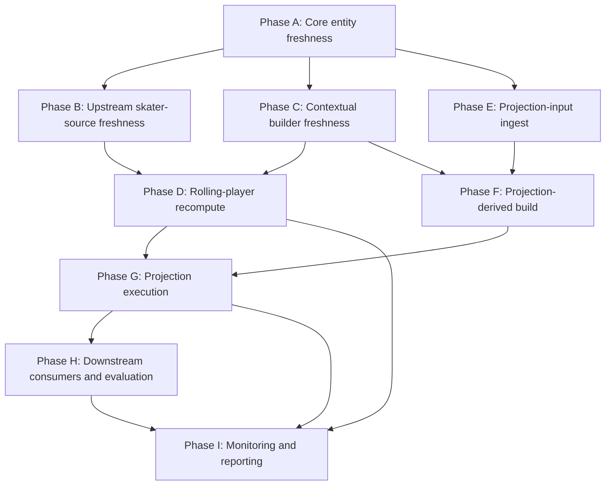

## Purpose

This artifact collapses the refresh entrypoint inventory into one explicit dependency graph for rolling-player freshness and FORGE freshness.

The intent is operational:

- define a small number of real phases
- make overnight versus daily incremental execution legible
- prevent builder/helper routes from becoming standalone cron obligations
- prepare for a single coordinator surface

## Graph Design Rules

- A phase exists only if it represents a true freshness boundary.
- Helper routes stay behind the phase they support.
- The daily incremental path must be smaller than the overnight path.
- The graph should support a sub-`4m30s` daily update without requiring separate cron jobs for every supporting builder.

## Approved Phase Graph

### Phase A. Core entity freshness

Purpose:

- ensure game ledger, team metadata, player identity, and roster assignment are current

Primary surfaces:

- `/api/v1/db/update-games`
- `/api/v1/db/update-teams`
- `/api/v1/db/update-players`

Produces:

- `games`
- `teams`
- `players`
- `rosters`

Why this is one phase:

- these routes update the shared identity and schedule substrate used by both rolling-player and FORGE execution
- they should be treated as one prerequisite gate, not three unrelated jobs

### Phase B. Upstream skater-source freshness

Purpose:

- refresh the skater-game source tables that rolling-player recompute depends on

Primary surfaces:

- `/api/v1/db/update-nst-gamelog`
- consolidated WGO freshness phase, currently implemented across:
  - `/api/v1/db/update-wgo-skaters`
  - `/api/v1/db/update-wgo-totals`
  - `/api/v1/db/update-wgo-averages`
  - `/api/v1/db/update-wgo-ly`

Produces:

- `wgo_skater_stats`
- WGO totals / averages support surfaces
- all required `nst_gamelog_*` tables

Why this is one phase:

- rolling-player arithmetic is only trustworthy when both the WGO row spine and the NST source tables are fresh
- operationally, this is one upstream freshness gate even though the code currently exposes multiple routes

### Phase C. Contextual builder freshness

Purpose:

- refresh the contextual tables required for PP-share, PP-unit, and line-context correctness

Primary surfaces:

- `/api/v1/db/update-line-combinations`
- one PP-context builder phase, currently backed by `/api/v1/db/update-power-play-combinations/[gameId]`

Helper-only surfaces:

- `/api/v1/db/update-line-combinations/[id]`
- `/api/v1/db/update-power-play-combinations/[gameId]` when used as a single-game repair tool

Produces:

- `lineCombinations`
- `powerPlayCombinations`

Why this is one phase:

- both tables are contextual builders, not core ingest
- they should be refreshed together in the orchestrated graph when the selected workload needs them

### Phase D. Rolling-player recompute

Purpose:

- derive and persist `rolling_player_game_metrics`

Primary surface:

- `/api/v1/db/update-rolling-player-averages`

Produces:

- `rolling_player_game_metrics`

Why this is its own phase:

- this is the key bridge between upstream source freshness and downstream projection readers
- it already owns the main runtime-control surface and should remain the central recompute phase

### Phase E. Projection-input ingest

Purpose:

- ingest PbP and shift data needed for FORGE derived tables

Primary surface:

- `/api/v1/db/ingest-projection-inputs`

Produces:

- `pbp_games`
- `pbp_plays`
- `shift_charts`

Why this is its own phase:

- FORGE uses a separate ingest path from rolling-player
- this phase already has chunking, resume, and runtime-budget controls

### Phase F. Projection-derived build

Purpose:

- materialize the strength and goalie derived tables consumed by projection runs

Primary surface:

- `/api/v1/db/build-projection-derived-v2`

Produces:

- `forge_player_game_strength`
- `forge_team_game_strength`
- `forge_goalie_game`

Why this is its own phase:

- it is the final data-prep layer before model execution
- it already has the right operational shape for chunked overnight and incremental runs

### Phase G. Projection execution

Purpose:

- produce current projection outputs and goalie start priors

Primary surfaces:

- `/api/v1/db/update-goalie-projections-v2`
- `/api/v1/db/run-projection-v2`

Produces:

- `goalie_start_projections`
- `forge_runs`
- `forge_player_projections`
- `forge_team_projections`
- `forge_goalie_projections`

Why this is one phase:

- goalie priors are not an unrelated side job; they are part of the same model-execution boundary
- the phase should be scheduled as one projection-execution block

### Phase H. Downstream projection consumers and evaluation

Purpose:

- refresh convenience projection surfaces and post-run evaluation tables

Primary surfaces:

- `/api/v1/db/update-start-chart-projections`
- `/api/v1/db/run-projection-accuracy`

Produces:

- `start_chart_projections`
- projection accuracy / calibration tables

Why this is one terminal phase:

- neither route should block rolling freshness
- both belong after the core projection outputs exist

### Phase I. Monitoring and reporting

Purpose:

- report status, audit coverage, and failures without acting as a data dependency

Primary surface:

- `/api/v1/db/cron-report`

Why this is separate:

- monitoring is required operationally, but it is not part of the data freshness DAG

## Dependency Graph

## Operational Interpretation

### What blocks rolling freshness

- Phase A
- Phase B
- Phase C when PP / line-aware outputs are in scope
- Phase D

### What blocks FORGE freshness

- Phase A
- Phase C for current line context
- Phase E
- Phase F
- Phase G
- rolling freshness from Phase D when downstream readers or projection features depend on rolling-player outputs

### What is downstream-only

- Phase H
- Phase I

## Overnight Flow

The overnight graph should run the full chain:

1. Phase A
2. Phase B
3. Phase C
4. Phase D
5. Phase E
6. Phase F
7. Phase G
8. Phase H
9. Phase I

Overnight goals:

- full-source freshness recovery
- contextual builder completeness
- full rolling recompute or broad current-season refresh
- full derived/projection availability for the next operating day

## Daily Incremental Flow

The daily incremental graph should be a narrower slice:

1. Phase A, only if stale
2. Phase B, restricted to the minimal current-day freshness window
3. Phase C, restricted to the minimal game set that affects current outputs
4. Phase D, restricted to the minimal rolling recompute slice for current-day correctness
5. Phase E, restricted to recent dates only
6. Phase F, restricted to recent dates only
7. Phase G
8. optional Phase H if the downstream consumer must be current for the same day
9. Phase I

Daily goals:

- no full-history backfill
- no broad helper-route fanout
- one constrained freshness chain that can be budgeted to `4m30s` or less

## Phase Boundaries That Reduce Cron Sprawl

The graph suggests the future cron surface should be organized around phase coordinators, not every underlying route:

- one upstream freshness coordinator covering Phases A and B
- one contextual-builder coordinator covering Phase C
- one rolling-player coordinator for Phase D
- one projection-data coordinator covering Phases E and F
- one projection-execution coordinator covering Phases G and H
- one monitoring job for Phase I

That is materially smaller than scheduling raw helper routes directly.

Current implementation note:

- the first coordinator landing now exists at [run-rolling-forge-pipeline.ts](/Users/tim/Code/fhfhockey.com/web/pages/api/v1/db/run-rolling-forge-pipeline.ts)
- this graph is now the recommended operator model behind that surface

## Key Consolidation Implications

### PP context is a graph problem, not a single-route problem

The current single-game PP builder route is sufficient as an implementation primitive, but not as the final operational surface. The graph requires PP freshness to behave like a batch-aware contextual phase.

### WGO should be treated as one upstream phase

Even if the current code remains split across multiple routes, orchestration should treat WGO freshness as one gate with one status outcome.

### Rolling and FORGE must no longer be scheduled as unrelated families

They are separate compute phases, but the graph makes clear that they belong in one orchestrated dependency chain if the goal is reliable freshness with a minimal job surface.

## Output Of Task `2.2`

The refresh-entrypoint inventory has now been reduced to an explicit phase graph that can support:

- route-surface reduction in `2.3`
- orchestrator-surface design in `2.4` and `2.5`
- runtime-budget work in `3.x`
- final runbook simplification in `5.5`
